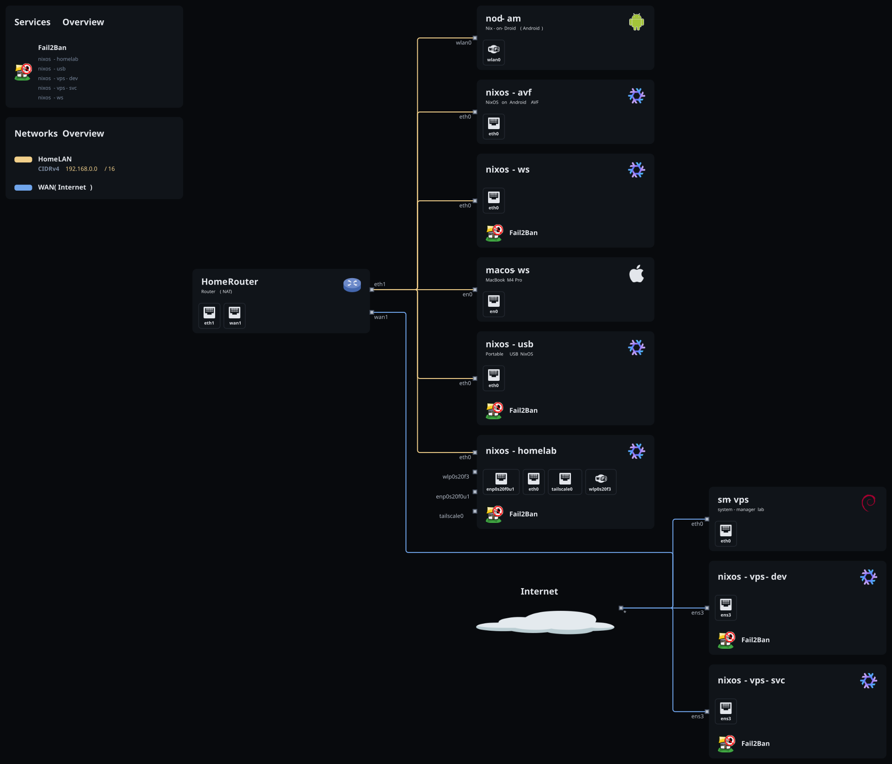

# 🎯 luck's dotfiles

> Personal Nix dotfiles — NixOS / macOS / Other Distro (debian) / Android fleet managed as a single flake.

## Stack

| Layer | Tool |
|---|---|
| Flake framework | [flake-parts](https://github.com/hercules-ci/flake-parts) |
| Systems | [NixOS](https://nixos.org) · [nix-darwin](https://github.com/LnL7/nix-darwin) · [home-manager](https://github.com/nix-community/home-manager) |
| Deploy | [deploy-rs](https://github.com/serokell/deploy-rs) |
| Secrets | [sops-nix](https://github.com/Mic92/sops-nix) |
| Non-NixOS | [system-manager](https://github.com/numtide/system-manager) |
| Pack | [nvfetcher](https://github.com/berberman/nvfetcher) (self-maintained `pkgs/`) |

## Hosts

- **nixos-ws** — desktop workstation (GNOME)
- **nixos-homelab** — homelab server (k3s)
- **nixos-vps-dev / nixos-vps-svc** — public VPS (k3s, incus)
- **nixos-usb** — portable USB live system
- **nixos-avf** — NixOS in Android AVF VM
- **nod-am** — Android phone (Nix-on-Droid)
- **macos-ws** — macOS (MacBook M4 Pro)
- **sm-vps** — system-manager lab on VPS
