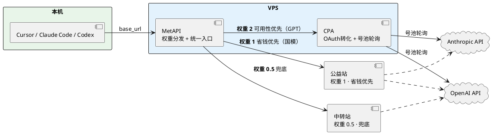

:::tip[TLDR]

***目前最优解仍然是 CPA + MetAPI***

买2-3个plus账号挂到CPA，把CPA挂到 MetAPI


---

或者说，应该换个认知，从一开始的 cursor, augment，主要用claude，算是刚开始尝试，再到去年10月份左右用了段时间GLM，再后来换到 GPT Team，从去年11月爽用到今年3月份，确实很爽，什么东西都不需要操心。直到 [2026-03-27] 当时写的是：

```markdown
天塌了，早上到了图书馆之后，就看到之前8块钱买的ChatGPT Team被 deactivated workspace 了，用不成。刷了一下论坛，看到个帖子：

- 反重力不让反代+缩水，Gemini cli反代拉闸。
- claude遇到史上最严的封号潮。kiro企业号对组织限流且杀号
- gpt的team plus乱杀且没有能开的卡，free号调用两次就死一个。
- cursor的支付宝卡ultra寿终正寝，trial卡的ultra一天就死，估计也活不久了

对我来说，没有了team这个稳定来源，只能先用各种公益站顶一阵。但是核心问题在于没有网页版的ChatGPT 5.4可以用了。这个model是真TM好用啊。另外，没有网页版之后对我目前的workflow影响很大。
```

之后确实用各种公益站顶了几天，一直到上周三，之前的注册机被风控很严重，free账号直接拉闸，导致公益站的 GPT-5.4 基本上也都用不了。

这个时候linuxdo基本上每天的热贴都是注册机相关的，协议注册基本上都挂了，也懒得研究，主流方案都是 半自动化手搓，具体来说就是用 chrome拓展来自动化整个workflow，看起来很美好，但是实际使用时核心痛点在于 DuckDuckGo 解码太慢（到了几乎不可用的状态），所以称之为“半自动化”

另外 free账号降速（20token/s），还砍token额度（普遍在0.5-3刀）。之前一周十几个号就差不多了，每周循环用，十来个号手搓也问题不大，现在一个号估计就3刀不到，一个简单的算术题：

每天基本上50M token，那7天就是350M token，如果一个号有3刀额度，那就需要手搓100个账号。但是现在砍到0.5刀，账号数就要x6了，压根没有可行性。


---


现在这些东西都是一天一变，所以这个方案也只是临时方案，未来或好或坏，或许又放开限制，可以爽用了，可以直接全量用公益站，或许进一步严格风控，连plus账号也隔三差五就掉。现在这个方案，在 MetAPI 的基础上，捏合了不同渠道的各种model，基本上能够保证无论如何都有能用的。那么进一步的是，是进是退，是能省点钱还是要多花点钱，只能看情况了。现在这个方案已经是在不折腾的情况下的最优解了。


:::


## 这里有几个问题


### 1、plus账号会掉，怎么办？

目前来看，plus账号算是能稳定使用半个月左右，如果活重，那就多开几个plus，放到号池里，如果活轻，那用国模也能凑活。这个方案可以做到进退有据。


### 2、为啥选择 MetAPI 而非更主流的 sub2api, new-api 来做分发?

sub2api or new-api? 二选一哪个更好？

https://linux.do/t/topic/1844510

***https://linux.do/t/topic/1803449/13***


```markdown
CPA (CLIProxyAPI)：
核心功能：协议转换 + 多账号轮询反代。
特别擅长把 Claude Code、ChatGPT Codex、Gemini CLI、Qwen Code 等 OAuth 会话 转成标准的 OpenAI / Anthropic 等兼容 API。
轻量、简单、兼容性强（支持网页版反代、模型映射、重试、round-robin 切换）。
有管理面板（management.html），可以手动添加/删除账号、查看日志。
最适合纯个人自用：号池搞好后，直接指向 CPA 的地址（localhost:8317）就能在 Cursor/Claude Code 里用了。

New-API：
核心功能：聚合管理后台 + API 分发平台（One-API 的增强版）。
擅长：统一管理多个“渠道”（可以把 CPA 当成一个上游渠道接入）、生成用户专属 Key、用量统计、模型列表管理、限流、计费（可选）、多用户支持。
公益站和中转站大多基于它搭建。
缺点：比 CPA 重一些，需要 Docker + 数据库（SQLite 也行），配置稍复杂。
```

上面说了 CPA 和 New-API 的区别，但还没解释为什么选 MetAPI。简单说：

**MetAPI 的定位在 CPA 和 New-API 之间**——它不像 CPA 那样只做单号池的协议转换，也不像 New-API 那样做全功能的聚合平台。MetAPI 核心做一件事：**多渠道权重分发**。把 CPA、公益站、中转站这些不同来源的渠道统一接入，按权重路由请求，自动 failover。没有 New-API 的多用户管理、计费、Key 分发这些我不需要的功能，配置也比 New-API 简单得多。

对于自用场景，需求很明确：一个入口、多渠道、按权重分发、挂了自动切。MetAPI 刚好覆盖这些，New-API 则过重。并且对于我这种需要接各种公益站的场景，MetAPI的易用性相较之下也更好。


## 方案详述

:::tip[TLDR]

把 free账号 + plus账号 都直接放到CPA里

把 CPA添加到 MetAPI，再把其他的什么 公益站、中转站 也都加进去

对于这些服务，我分为三类：为了可用性默认去用的（CPA、）、为了省钱尽量去用的（公益站）、为了兜底能不用则不用的（中转站）

***所以需要调整相应权重，公益站保持默认的1不变，CPA调整为2，中转站则调整为0.5***


:::


### 简易架构图





```markdown
2. CPA的“转化”到底起了什么作用？
是的，CPA（和New-API）的主要作用是转化和池化，但不是“魔法解锁”。
CPA具体做了这些事：

OAuth授权转化：把你在网页上登录的ChatGPT账号（Free或Plus）转成标准的OpenAI兼容API接口（/v1/chat/completions 等），方便Cursor、Claude Code等工具直接调用。
多账号轮询（Round-robin）：自动在你的号池里切换账号，哪个号额度快用完或被限，就切下一个。
模型映射与兼容：有些版本的CPA能让Free账号在模型列表里显示更多选项（包括GPT-5.4），并加上参数（如reasoning.effort: xhigh等）。
重试、流式、日志等：提升使用体验。
```


### 为啥选择部署到VPS而非local?

先说结论：**无论 VPS 是否是 sing-box 节点，都建议部署在 VPS 上**，但理由不同。

#### 情况一：VPS 是 sing-box 出口节点（推荐）

日常流量路径：

```
本机 → sing-box → VPS(sing-box outbound) → OpenAI/Anthropic API
```

CPA + MetAPI 部署在同一台 VPS 后：

```
本机 → sing-box → VPS(MetAPI → CPA → OpenAI API)
                       ↑ CPA→OpenAI 走 VPS 本地出口，不经过 sing-box 隧道
```

- **CPA→OpenAI 这一段直接从 VPS 出去**，不走 sing-box 封装/解封，零额外跳数
- 本机→VPS 这段本来就要走（sing-box 隧道），没有变化
- 实际上可能比本地部署还略快：省掉了本地 CPA→sing-box→VPS→OpenAI 中 CPA 请求经过隧道的那一层开销

#### 情况二：VPS 不是 sing-box 节点（仍然建议）

流量路径：

```
本机 → sing-box → sing-box-VPS → 目标VPS(MetAPI → CPA → OpenAI API)
```

或者如果目标 VPS 从国内直连可达：

```
本机 → 目标VPS(MetAPI → CPA → OpenAI API)
```

相比本地部署（本地 CPA→sing-box→VPS→OpenAI），多了一跳 sing-box-VPS→目标VPS，增加约 50–100ms。但：

- LLM API 单次生成本身是 **1–5 秒量级**，多 50–100ms 几乎无感知
- 首 token 延迟差异在流式输出中可以忽略

#### 不变的理由（与是否 sing-box 节点无关）

| 维度 | 本地 | VPS |
|------|------|------|
| OAuth session 保活 | 依赖本机在线，休眠/断网即断 | ✅ 24h 稳定运行 |
| 多设备访问 | 需内网穿透 | ✅ 直接指向 VPS 地址 |
| 注册机回调 | 需暴露端口或穿透 | ✅ VPS 天然可达 |
| 号池状态一致性 | 本地多实例可能冲突 | ✅ 单实例，状态唯一 |
| 首 token 延迟（sing-box 同机） | 基准 | ✅ 更低或持平 |
| 首 token 延迟（非 sing-box VPS） | 基准 | 略增 50–100ms，无实际影响 |

唯一需要做的安全措施：**VPS 上的 MetAPI 配好 API Key 鉴权，本地的 Cursor/Claude Code 把 `base_url` 指向 VPS 即可。**


### MetAPI 技巧

- 1、手动导入这些公益站会很慢，所以建议搭配 https://github.com/qixing-jk/all-api-hub 使用。因为 `all-api-hub` 是浏览器插件，所以可以直接读取这些公益站本身的 session 等登录信息，免手动录入。然后我们可以直接从 `all-api-hub`导出这个JSON，再直接导入到 MetAPI里。
- 2、MetAPI 支持对于model批量测活
- 3、在“连接管理”里，尽量通过“账号管理”（而非“API Key管理”）来管理所有provider
- 4、MetAPI 对于 NewAPI 支持最好，添加站点后，在“连接管理”直接添加相应“系统访问令牌”，之后就可以通过 MetAPI 实现完全托管（自动签到等操作）。
- 5、【Model权重管理】想要实现上面说的“分级权重”，在 「路由」中选择相应model，然后直接拖动其中的provider，来分层 P0, P1, P2（这里我们的方案就是 GPT sub走P0, 公益站走P1，中转站兜底走P2）。但是注意为了保证可用性，需要把路由策略改为“稳定优先”，否则 高权重provider挂了之后，可能也不会自动转发到后面的provider


## 其他


### 手搓注册机


:::tip

下面仅列举相关帖子和repo

因为相关方案都不太成熟

---

这套东西的瓶颈在于 DDG转发，接受邮件太慢了，几乎是不可用状态。如果要优化应该直接把整个DDG部分移除掉。用cf转发是个好思路，但是要想想怎么实现自动化。

:::


[【一键CPA认证+gpt注册+上传】CPA自动注册+OAuth认证的Chrome插件发布！！！！ - 开发调优 / 开发调优, Lv2 - LINUX DO](https://linux.do/t/topic/1900617)

[【纯小白手搓GPT教程】0注册机，纯古法手搓！ - 开发调优 / 开发调优, Lv1 - LINUX DO](https://linux.do/t/topic/1897358)

[【4/11 15:50更新】优化版CPA自动注册+OAuth认证的Chrome插件，新增2925邮箱支持 - 开发调优 / 开发调优, Lv1 - LINUX DO](https://linux.do/t/topic/1942057)

[自动化古法注册（4月13号23点 v7.0.0版本发布）【一键CPA/SUB2api认证+gpt注册+上传】Chrome插件（四天不到star数已经破1.1K啦） - 开发调优 / 开发调优, Lv1 - LINUX DO](https://linux.do/t/topic/1928372)


[基于大佬的注册机, 增加了Hotmail的支持(已发) - 开发调优 - LINUX DO](https://linux.do/t/topic/1953503)

[hotmail插件注册机（90％成功率，两分钟一个） - 开发调优 / 开发调优, Lv1 - LINUX DO](https://linux.do/t/topic/1951143)

[hobyleo/codex-oauth-automation-extension: Chrome扩展：支持OpenAI OAuth注册、验证码获取、CPA回调验证与自动恢复](https://github.com/hobyleo/codex-oauth-automation-extension)


---

***[授人以鱼不如授人以渔，注册机思路教程，讲给懂的人听 - 开发调优 / 开发调优, Lv1 - LINUX DO](https://linux.do/t/topic/1943195)***

[Codex：不建议注册机出来的账号自动上传至反代 - 开发调优 - LINUX DO](https://linux.do/t/topic/1940011)


https://github.com/haeyupi/hotmail_re_plugin


### CPA两个坑


我遇到的一个问题：

compose.yml 里没设置 `network_mode: host`，ports映射只写了 8317，导致上面 手搓方案里，到了“第九步” OAuth callback时，1455 port 通不了。查了一下，1455就是codex的port，所以猜想就是没读到 container 里的 1455端口。


***https://linux.do/t/topic/1679542***

https://linux.do/t/topic/1932254/7


### 中转站推荐


https://x.com/Pluvio9yte/status/2043530651996152204
中转站


https://linux.do/t/topic/1950247

订阅分发 逆向 对接上游 就这三种。还有假模型骗人


```markdown
https://linux.do/t/topic/1851411/45
---

我不是号商，有些原理我不清楚，就我收集到的信息和实际使用。1.最低7块，批发5块。2.我不认为有什么质保，因为不管多少钱的代充都是获取你的session然后充值，比team风险大很多，plus掉了事小，封号就炸刚了。不会私信网址，因为有推广的嫌疑，发这张图只是为了告诉大家要擦亮眼睛。
```


### 方案：AAR + CPA + new-api


***[【水一帖】聊一下我的中转方案，any-auto-register+CPA+new-api，自用基本够了。 - 搞七捻三 - LINUX DO](https://linux.do/t/topic/1943576)***


AAR + CPA + new-api


https://github.com/lxf746/any-auto-register


### 方案：AutoTeam


[【开源】AutoTeam: 一个 Team 订阅，无限 Codex 额度 - 开发调优 / 开发调优, Lv2 - LINUX DO](https://linux.do/t/topic/1943318/23)


[cnitlrt/AutoTeam: ChatGPT Team 账号自动轮转管理 - Codex 额度监控、自动换号、CPA 认证同步](https://github.com/cnitlrt/AutoTeam)


```markdown
众所周知，一个0刀gpt team里面可以有5个seat，如果里面的成员变成6个就会有封team的风险，由于现在openai将team的额度给下调，导致一个team账号问几个问题就额度见底了，所以我就在想能不能搞个自动化的workflow，让这5个seat不停地换人, 用完的踢掉, 恢复了的重新进, 实在不行就自动注册新号顶上, 全程不用手动操作。
```


### 方案：GenericAgent

[地表最强web | GenericAgent 实现注册机思路 - 开发调优 / 开发调优, Lv2 - LINUX DO](https://linux.do/t/topic/1968890)

基于 GenericAgent 这个 `Agent Browser`来实现对于注册机的自动化操作。这个思路还真不错。


## 中转站 vs Team/Plus [2026-04-16]

:::tip

实测对比一下同样是¥5，team还是 ikun 中转站？哪个更省？实测后写到之前那个blog里

:::


[Pricing – Codex | OpenAI Developers](https://developers.openai.com/codex/pricing?codex-usage-limits=plus)

***如果按照官方文档所说，那么目前 Team 和 Plus 的用量完全相同，如果是 GPT-5.4，每5h的限制都是 `20-100` 个 msg***


[大佬们每天codex蹬多少token？ - 搞七捻三 - LINUX DO](https://linux.do/t/topic/1974341)


[求中转推荐编程太烧钱了 - 搞七捻三 - LINUX DO](https://linux.do/t/topic/1968190/13)


[codex team额度再次大砍！ - 搞七捻三 - LINUX DO](https://linux.do/t/topic/1963609/3)

[不要再买任何GPT 5X 20X PRO，已经掉了 - 开发调优 / 开发调优, Lv2 - LINUX DO](https://linux.do/t/topic/1981777/10)


---

[别再被骗了！谁才是真正的 Coding 之神？实测 GPT-5.4/Claude 4.6等大模型，百字人话开发 B 站首页（新范式|深横评|实机测）_哔哩哔哩_bilibili](https://www.bilibili.com/video/BV196PxzREHe/)

***[别再被平台速率标注骗了！实测 9 大 Coding 套餐挑战 100/1k/10k/100K 上下文速率（新范式|深横评|实机测）_哔哩哔哩_bilibili](https://www.bilibili.com/video/BV14E9EBhEvT/)***


