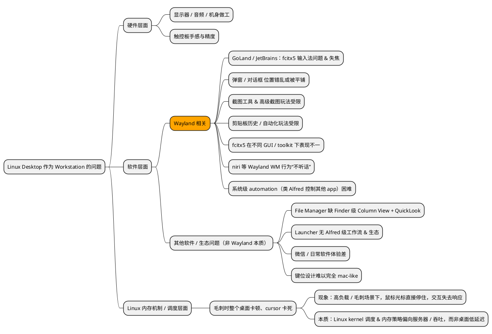
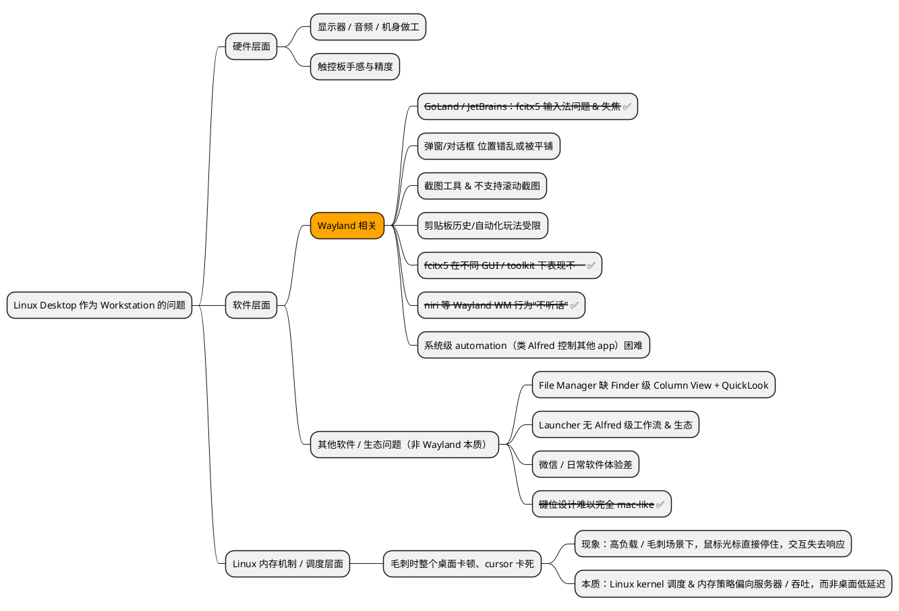

:::caution

注意本文仅适用于2025年年底的当下

开篇明义，如果要给NixOS Desktop的体验打分，我会打60分。“并非不能用，只是不好用”

最终我会说两点：


1、并非完全用不了，正如本文开头所说，我会给Linux Desktop的综合体验打60分。并非不能用，只是不好用。并且这个不好用很难解决，至少并非我能在短期内解决的。“问题是永远解决不完的。问题是可以解决的。” 事实上我也尝试解决了很多问题，来弥补Linux Desktop 相较于 Mac 在使用体验上的缺失。只不过“太多的问题需要自己解决了”，甚至是“无穷无尽的问题”。

但是最终也只是从20分，提到了60、70分。永远也无法弄到Mac的80、90分。至少说我在已经付出了很多时间和精力的情况下，也就只能做到这个程度了。“我累了”。也懒得浪费时间了。


2、细节很重要


:::


在写为什么现在相从 NixOS Desktop 迁移回 MBP 作为workstation

那么首先要说明当时为什么要从 MBP 迁移到 NixOS Desktop

主要是两点原因，恐惧和贪婪：

1、恐惧（厌烦）于Mac不是原生支持Docker，需要通过 linux container 来做模拟，这就非常愚蠢。另外，对于nix来说，应该说 nix-darwin和真正的NixOS终究还是两码事，尤其是我在mac上某次cleanup时，直接把mac的installer本身直接gc掉了，就更加深了我迁移到NixOS的决心。


2、贪婪于想要通过把日常workstation完全切换到Linux Desktop，来让自己更熟悉linux相关操作（Darwin终究是BSD，太多命令跟linux不一致了。另外还有，linux使用systemd，而mac则使用launchctl这种相关经验几乎无法复用到其他场景的工具）。事实上我在30%的程度上达到目的了。至少对于systemd相关的命令之类比之前熟悉太多了。我讨厌Darwin这种闭源distro，所以在切换时在日记里写了“久在樊笼里，复得返自然”。***毫无疑问，对于一个nix用户来说，日常使用NixOS的诱惑是巨大的。***

所以当时痴迷于Nix的我，会认为“mac就是小孩玩的”

***在经过了无论是Desktop还是 [关于NixOS的容器化方案 | lucas](https://blog.lucc.dev/2025/container-solutions-for-nixos/) 之后，基本上对NixOS祛魅了，知道了其能力边界。***

***应该说Nix赋予NixOS的预配置能力，对于真正比较heavy的需求，无论是Desktop还是Server，都是不足以胜任的，但是对于绝大部分主流cli工具，则提供了非常棒的预配置能力。***


## 前情提要

:::info

关于nix，先标记几个重要milestone

---

从今年 2025-07-11 初试 nix（主要是 nix-darwin）

到 2025-09-20 开始从 MBP -> NixOS，尝试玩 NixOS Desktop，并把其作为日常 workstation 使用。没有使用任何类似KDE, GNOME 之类的DE，所有东西都是从0到1自己glue (比如说用 niri+mako搓音量键的音量notification 之类的)

再到最近，每天日常使用也有整整三个月了，从整个 Linux Desktop生态磨了一圈，基本上也心里有数了

所以写下这篇blog，作为这个阶段的

---

注意

:::


### 尝试 Desktop Shell


某天在bz看到了Noctalia之后，知道了有，搜索到 [Have you tried two or more shells? (Exo, Noctalia, Dank Material Shell, ...) I'm looking for comparisons of them. : r/niri](https://www.reddit.com/r/niri/comments/1nwufq9/have_you_tried_two_or_more_shells_exo_noctalia/) 这个帖子后，把


  【2025-10-14】昨天白天一直在弄Desktop Shell相关工具。简单写点当前的相关认知。比较主流的就是这4个（按照star排序）：【DMS】、【Noctalia】、【caelestia】、【debuggyo/Exo】。我自己先后体验了Noctalia和DMS，最后选择了DMS，目前在用。我说下自己的看法。
  1、DMS确实比noctalia更成熟。无论是bar还是DMS settings本身的UI都更好。功能也更全面。
  2、noctalia确实有很难用语言表达的lagging，不多（可能不到3ms），但是确实影响体验
  3、帖子中有人提到，“DMS的操作逻辑是mouse-based”，跟niri这种原生触控板逻辑冲突。这点我没体会到。可以通过设置快捷键来解决该问题，不是吗？已查证，确实如此。***可以认为shortcut作为中介（即把触控操作（在niri）映射为shortcut），可以保证触控还是键鼠两套逻辑都独立存在，互不干扰。***
  4、DMS的问题：支持NixOS，但是并非类似noctalia那种NixOS为first-class，体现在：1、noctalia的文档有很完善的配置项说明（也就是nix的常规流程，先照着文档写配置，然后rebuild即可），而如果想在NixOS上使用DMS，最佳工作流程是直接安装，什么配置都不要修改，在界面上设置自己想要的配置，然后把settings.json转nix，这样才能拿到想要的nix配置（再作为 default-settings.json）。DMS只有README和discord，官方文档是关于IPC和theme设置的，没有任何配置项相关的。2、另外，关于配置项，还有一点不得不说DMS不如noctalia的点，就是DMS的配置项完全没有按照不同feats做抽象，基本上都是一维数组，配置项设计有点差，被人认为是“bugged but one-time setup”。这两项只是吐槽，属于可以忍受的缺点。“又不是不能用”。
  【2025-10-17】把 DMS、noctalia这些都移除掉了。两点原因：１、开销太高，拿DMS举例，quickshell内存占用 350~450MB, DMS cli 20MB. ２、有很多用不到的功能。比如 wallpaper, weather, MenuBar, Dock, Launcher, Gamma Control, Clipboard 之类的，很多功能多有重复。比如说launcher，DMS的launcher无缝集成于DMS，相应的，其workflow无法迁移到其他工具，DMS的workflow通过QML/js实现（且接收数据格式为plaintext，而非JSON）。说白了，这些bundled到一起的工具，肯定不如别人精心打磨的好用。


## 有哪些问题？

我尝试使用了一段时间的 nixos desktop 作为 workstation

感觉确实有一些问题，并不如 MBP 好用，尤其是很多细节，不一而足

对我来说比较难受的几个点：


所以我是否可以使用 MBP 作为workstation?

注意这个问题的核心并非在于可否，有很复杂的context，所以需要综合分析。问题在于：

1、公司机器：入职后公司会提供机器。我之前都不会去用，而是直接用自己的MBP，现在向来就很亏。对于这个问题，我之前的想法是把公司机器刷成
   nixos desktop，直接使用，但是正如上面所说，nixos desktop的使用体验并不好。

所以我的方案是，直接把公司的机器刷成 nixos minimal

所有重服务都直接跑在公司机器上，我的MBP来作为日常使用，使用体验会更好。


graphical更用户友好（UI设计），但不代表是对的，有两条路，一条正确但艰难，另一条容易但错误。但是，问题的关键在于，怎么界定对错？谁能界定？





## 硬件层面


- 【硬件素质】显示器、音频之类的硬件。这些windows机器本身素质就不如mac，软件层面更不必说了。

触控板


## linux内存机制

- 【linux的内存机制】（以及没有对于workstation场景做CPU调优）并不适合作为workstation使用 # （比如说在毛刺场景下，cursor会直接卡死不动）


## 软件层面


### ***wayland相关***


:::tip


wayland 尚不成熟，带来很多问题

:::


所有人都知道“wayland相较于X11的优势”，无外乎“X11是1980年的老东西了，历史包袱太重。随着硬件提升、软件需求，需要全新的现代桌面架构” 这套磕

但是一直到今年6、7月份，在社区才出现了质疑wayland的声音

乃至于看到 [Half of Linux Users Stick with X11, Despite Years of Wayland Being Forced](https://pca.st/5xf6zkst) 所说，*Wayland has been the default for several years on the largest Linux distributions (Ubuntu, Fedora, etc.), yet Wayland usage has actually decreased since 2024.*

为啥一个被认为是为顺应时代潮流，革故鼎新、推陈出新，用来替代掉一个1980年的老家伙的wayland 为啥会出现这么多问题，乃至于很多人宁愿去用1980年的老东西也不去用它？


[Wayland Takes Window Positioning Somewhat Seriously](https://www.youtube.com/watch?v=_qU7PyViHOU)


```yaml


- ？ EQC三角全面提升，之所以xxx，

- 【XDG协议（X Desktop Group）】FreeDesktop 跨桌面环境标准化协议
# XDG_CONF_HOME  ~/.config
# XDG_CACHE_HOME ~/.cache
# XDG_DATA_HOME  ~/.local/share
# XDG_STATE_HOME ~/.local/state

```


#### goland


[fix(goland): 通过给goland做wrapper了一层x11启动，来保证fcitx5可用。 · xbpk3t/dotfiles@ae294be](https://github.com/xbpk3t/dotfiles/commit/ae294be6c6e2b27995a0d3dec5f0d3057921a449)

---


目前来说goland的使用存在两难困境。如果使用wayland，那么就无法使用fcitx5，如果使用x11，那就无法在switch window(switch focus)之后，自动获得焦点，也就是需要再次手动点击，才能输入文本。

另外还有一个弹窗位置的问题，这点其实我没搞懂，具体是谁的锅，是wayland臭名昭著的position问题？但是为啥我在x11下，弹窗也会 out of window? 我看到也有人说这个是 niri 的问题。没搞懂。但是在写这段 commit msg 的当下，这个bug已经fix了

goland wayland fcitx5

focus

tootip 弹窗问题

https://youtrack.jetbrains.com/projects/JBR/issues/JBR-5672/Wayland-support-input-methods

https://forum.manjaro.org/t/some-applications-no-longer-work-with-fcitx5-in-wayland/181743/12


---

- [xwayland-satellite] 使用 systemd 开启 xwayland daemon，保证其运行。而非之前直接通过 niri 里 spawn-at-startup 运行 xwayland. 必须如此，否则goland无法启动。
-

---

为什么建议“用 XWayland”

- 目前唯一能让 fcitx5 正常注入 JetBrains IDE 的办法就是强制 IDE 走 X11，因为 JetBrains 还没把新 Runtime 带来的 Wayland 输入法补丁发到 release runtime，官方也在博客里建议在 Wayland 有问题时退回 XWayland。(blog.jetbrains.com (https://blog.jetbrains.com/platform/2024/07/
  wayland-support-preview-in-2024-2?utm_source=openai))
- XWayland 本质是让客户端认为自己在 X11，会沿用 XMODIFIERS=@im=fcitx 这类传统机制，fcitx5 在 X11 模式已经成熟，所以“在 X11 下理论上就不会有该问题”这点确实正确。


#### 截图工具

使用 [flameshot](https://github.com/flameshot-org/flameshot) 作为截图工具

不如mac上snip的20%好用，除了UI不好看、用起来有点卡以外，最关键的一些问题：

- 默认全屏截图后就直接保存到本地。你怎么知道我不是想存在clipboard，然后发出去呢？所以每次都需要使用普通截图，然后再截取全屏，再Save To Clipboard操作，就很麻烦。
- 更关键的，不支持滚动截图


### ~~WM (niri/hyprland)~~


```yaml


- url: https://github.com/YaLTeR/niri
  doc: https://yalter.github.io/niri/
  score: 3
  des: 【WM//Wayland Compositor】
  record:
    - 【2025-10-17】移除【hyprwm/Hyprland】

    - 【2025-10-21】感觉还是不太适应niri这种tiling WM，转而去尝试了几个stacking WM（依次是 labwc, SwayWM），但是各自也都有很多其他问题（比如说二者的开销也都不低（都在110MB左右，niri只有不到50MB内存开销），SwayWM本身支持tiling, stacking, floating, tabbed　四种模式），所以又用回niri了（至少还是个不算太坏的选择）。tiling的核心痛点在于window太多，难以定位（需要Mod+Tab翻找）。现在想来，当时之所以不想用niri更多在于很多弹窗“该弹的弹不出来”，但是的问题在于，其实niri本身也支持window floating（窗口浮动模式），并不需要切换到stacking WM，也能解决问题。

    - |
      【2025-11-13】记录一个关于Desktop的基础常识
      1\【基本认知】WM和DE是两码事，前者包括
      2\ 只有linux可以单独使用WM而不使用DE。而linux上的DE本身通常也绑定了WM(乃至一整套bundled pkgs，比如说 GNOME绑定Mutter，KDE Plasma绑定了KWin，XFCE绑定xfwm4。当然，有些 DE 相对更“松耦合”：比如 XFCE、LXQt、MATE 一般可以比较容易换掉默认的 WM（比如换成 i3），照样用它的面板和文件管理器。)
      3\ WM和DE之间的关系，就像是毛坯房（WM = 毛坯 + 隔断 + 门窗位置 + 基本开关布局）和整套精装修方案（DE = 精装修 + 家具家电成套）。前者只规定了每个房间的大小，整个房子你可以按需装修，丰俭由人。后者则不同，一定是有大量你压根不需要的（但是已经打包进来的东西，但是你无法移除掉这些东西）。

      - GNOME
      - KDE（神似Win10，KDE内置插件太多，比如说KDE钱包、KDE connect、PIN之类的，很重）
      - xfce（始于1996，跟WinXP很像，内置开销低，UI不够现代化）
      - Cinnamon(Mint内置的，KDE+GNOME杂交。用X11而非wayland)

      4\ OS -> 显示协议 / 图形栈（X11 / Wayland）-> WM (Compositor) -> DE　三者之间的关系

```


> ***归根到底 linux desktop 的WM会把window作为第一公民，而mac则把应用作为第一公民***

> ***归根到底 linux desktop 的WM会把window作为第一公民，而mac则把应用作为第一公民***

> ***归根到底 linux desktop 的WM会把window作为第一公民，而mac则把应用作为第一公民***


重要的事情说三遍

***之所以感觉linux desktop的窗口管理很别扭，就在于Mac本身是三层结构（Mac -> APP -> Window），而Linux的WM基本上没有APP这层概念，只有window这层概念。Mac的APP这层抽象实现了（OS和window）解耦***


在体验Linux Desktop的这三四个月，至少有70%的时间都在使用niri

内存占用极低且稳定，都是其优势。并且通过 [nirius](https://docs.rs/nirius/latest/nirius/) 实现了 toggle switch window

为啥我后来又切换回 hyparland 呢？

就是因为hyprland有（类似sway的）tabbed layout

可以很方便地切换不同window

但是即使如此，也远不如这里又涉及到“键位设计问题”，在使用机器时，会有

通过 CMD+Tab 切换APP

通过 CMD+` 切换window

通过 CMD+E 切换该window里的Tab


### launcher


```yaml

- url: https://github.com/chmouel/raffi
  des:
  record:
    - |
      【2025-10-20】【记录把launcher工具从mac迁移到NixOS的相关认知】我受不了 rofi系（【rofi】、【wofi】、【tofi】、【fuzzel（+raffi）】）的这种很原始的数据组织方式（（两种：stdin 纯文本行、tab/null 分隔扩展）非JSON，并且天然不支持icon之类的），也受不了 vicinae这种明明很多东西拿shell就解决了，但是他非得要求用ts。因为我现在有很多workflow，都是用golang写的，我想直接用shell调用就完事了，不想再迁移到ts。那么在 linux下面，还有哪些launcher可以供我使用呢？需要排除掉 不兼容wayland的，也排除掉上面这两种类型。
      1、Anyrun 的插件应该是强制用rust写，有个预定义接口类（4 个核心函数：init、info、get_matches、handler），必须要我们自己实现一下，插件才可用。并且bug挺多的，并且其实是个个人项目，maintainer 本身也不会去fix其他用户产生的问题。
      2、walker 的问题在于内存开销过大（在200MB~300MB之间（Rust+GTK4 overhead）。相较之下，rofi系不谈了（本身是cli，没有daemon），而 alfred在mac上的内存占用不超过30MB，vicinae基本上在150MB左右），我就没找到有几个walker插件。其本身肯定是支持JSON数据的，否则无法实现嵌套item。但是其生态确实不太行。另外还有两个问题 1) 还要flake，并且还要一个 elephant（rust实现的） 作为数据源 2) 服务本身内存占用。结论：很明显ROI很低，受益和成本不成正比。workflow生态差、服务开销大、功能也无法完全跟alfred对齐。但是相对于vicinae的优势在于其支持mod操作。
      3、Ulauncher 在NixOS上安装时直接报错了（marked as insecure, refusing to evaluate. 问题在于Ulauncher仍然依赖libsoup2（[amend]: 依赖webkitgtk_4.0（进而libsoup2），CVE未完全迁移到libsoup3。GitHub v6分支在重写extension API，但Wayland支持和libsoup3更新仍未确认。插件主要是Python，允许shell调用），而以上CVE在libsoup3已经fix了）
      4、cerebro 用 electron实现，直接一票否决。
      5、launchy ruby实现的，跨平台，但是我需要的功能，一个没有。只支持最基本的APP和文件搜索。不考虑。
      6、Wox 有点抽象（就是有用的功能一个没有，都是没用的）。并且在linux下兼容一般，生态有限。
      7、Albert 试用了一下，也很抽象。预装了一大堆没用的workflow，太重了。但是自称是linux平台的alfred。
      8、fuzzel是现在社区里普遍推荐的一个rofi系的launcher，确实在rofi系里还不错（UI更好看，有很多第三方theme（但是默认的那个>，无法移除就很蠢））。但是问题在于fuzzel不同于rofi（可以配置为combi模式（支持run、drun、window、ssh、file browser、keys、script这些模式，可以认为fuzzel只支持drun模式（也就是必须定义为 .desktop，才能在fuzzel的list中列出来））），但是把自定义workflow做成.desktop文件，明显是不合理的（这些就是bin啊，又不是APP）。所以就有了raffi，但是raffi的问题在于，可以很容易地把我们的workflow列出来，但是raffi跟fuzzel是独立的，也就是必须要执行raffi才能列出来我们的workflow，就很割裂。当然上面也说了，最终

      ---

      我的需求一直是明确的，我从mac迁移到NixOS，最关注的点之一就是launcher。我对于 launcher 的几个核心需求，除了在linux上的核心需求（1、是否轻量。2、是否跟wayland兼容），以外就是（alfred上我最常用的几个功能）：
      - snippets
      - web search
      - workflow
      - clipboard history
      - universal actions

    - |
      【2025-10-17】绕了一大圈，最终还是决定使用vicinae。现在也已经把所有workflow迁移过去了。

      最终我的方案：为了避免跟某个launcher耦合太深（两点：
      1、之前会以为一直使用mac，所以跟alfred耦合太深了，这次迁移就很痛苦。
      2、vicinae也是被迫选择，所以为了随时跑路），所以最终的技术方案是，把之前的【docs-alfred】从之前跟awgo完全耦合的代码，加了一个output参数，用来直接吐各种launcher需要的数据格式。***因为vicinae不支持直接调用这个bin作为extension，必须用vicinae提供的ts的这套东西包一层（也就是层wrapper）。尽量把未来跑路时的迁移成本降到最低（实际上bin的好处在于，以后即使要迁移，我甚至可以先用bin去跑，直接把vicinae踢掉，然后再给这些bin套层新launcher需要的wrapper作为workflow使用）***。

      目前的使用感受：
      1、【矮子里面选大个】在mac上我就更喜欢alfred，而非raycast。所以用vicinae也是被迫选择。
      2、【Vicinae 与 Raycast 插件兼容性】核心优势之一，在于 跟 raycast 插件兼容。但是这个兼容是（从Raycast 到 Vicinae）单向兼容，也就是vicinae可以使用raycast插件，反过来则不可行。
      3、vicinae不支持类似 Alfred的Mod操作（也就是CMD、Option、Shift 在 Filter List 中的多重操作）
      4、上面列的几点功能：1) 原生支持workflow、clipboard、web search（需要配置fallback searches）。2) vicinae原生不支持snippets，所以我单独写了个workflow（将来也方便迁移）。3)不支持 universal actions

      就以上这短短20行，是纠结了至少一周，做了各种调研，grok都问了至少50轮，所有以上这些launcher都写了nix配置，装了删，删了又装，各种比较，最终才敲定出来的方案。真TM难啊。仅作记录，仅供参考。当然，我其实对vicinae还是不满意的，如果在linux上没有在功能上足以与alfred相媲美的工具，那么我希望足够轻量（类似rofi系这种cli工具（调用时20MB以下的内存开销），但是又支持JSON数据格式和icon展示的）。
    - 【2025-11-13】大概写了上面的record之后两三天就又用回raffi+fuzzel了。一直用到现在，基本上可以认为在90%程度能替代alfred体验（但是这10%确实是无论如何也无法解决的）。我确实不喜欢raycast这种操作逻辑的工具，或者说很讨厌，更确信了。


```


正如上面所写，在兜兜转转绕了两圈之后，最终还是用回了 fuzzle + raffi

确实能够实现之前alfred里70%的需求，也远比vicinae好用的多，但是剩下的30%是致命的，比如说：

- ***fuzzel 不支持 fcitx5***  [#615 - Add IME (e.g. fcitx5) support - dnkl/fuzzel - Codeberg.org](https://codeberg.org/dnkl/fuzzel/issues/615)
- fuzzel 不支持 preview
- fuzzel 不支持 PgUp 从最后一个item往上翻item（只支持 PgDn 往下翻item）
- fuzzel 不支持在keyword后面直接输入input，必须要enter之后重新弹出一个input框再输入（fuzzel本身机制所限），如下代码所示（alfred在关键字后，直接enter，如果后面有必填args的话，那么cursor会直接进入下一个arg的位置，让你来填写文本。很细节的问题，但是很影响使用体验）


<Github url="https://github.com/xbpk3t/dotfiles/blob/main/home/nixos/gui/fuzzel/raffi-bookmark.nu" />


当然不得不说，我通过 nushell 把 bookmark, pwgen, snippets, clipboard text-action, ghs (github), nosleep 之类的这些无论是alfred内置的，或者workflow 都自己手搓了一遍，真的能满足70%的需求。但是也就仅此而已了。上面这几点问题，虽然很细节，但是对于使用体验，却很致命。


### 缺失常用软件


- 【日常软件】wechat等常用软件差点意思，包括 截图工具、剪贴板、输入法


比如说 wechat等常用软件差点意思

我还需要 finder

- 【文件管理器】没有类似finder这种 Column View 以及 Quicklook的 File Manager


 怎么做出以上结论的？在刚切换到NixOS desktop时，以为可以100%只用yazi替代，但是之后发现在两个经典场景下仍然需要GUI File Manager，所以找到了thunar，但是thunar也并不好用，只提供一些基本功能。所以放弃。


### clipboard tool

- [cliphist](https://github.com/sentriz/cliphist)
- [ringboard](https://github.com/SUPERCILEX/clipboard-history) ringboard不支持直接list latest
- [clipse](https://github.com/savedra1/clipse) clipse 不支持search
- [ClipBoard](https://github.com/Slackadays/ClipBoard) cb只支持search操作，不支持 latest N items操作

---

按照Linux Desktop的通用实践，组装 `fuzzel + cliphist` 来实现剪贴板

但是 fuzzel 不支持 preview，所以只能看到前面几个字，也无法查看图片

- [#496 - main: add --preview-selection, prints outputs when selection changes - dnkl/fuzzel - Codeberg.org](https://codeberg.org/dnkl/fuzzel/pulls/496)
- [#593 - WIP: ✨ Add --preview-selection, alt approach - dnkl/fuzzel - Codeberg.org](https://codeberg.org/dnkl/fuzzel/pulls/593?ref=mark.stosberg.com)

除了fuzzel，cliphist本身也有问题


<Github url="https://github.com/xbpk3t/dotfiles/blob/main/home/nixos/gui/fuzzel/fuzzel-clipboard.nu" />


```log
cliphist help
usage:
  $ cliphist <store|list|decode|delete|delete-query|wipe|version>
options:
  -config-path (default /home/luck/.config/cliphist/config)
    overwrite config path to use instead of cli flags
  -db-path (default /home/luck/.cache/cliphist/db)
    path to db
  -max-dedupe-search (default 100)
    maximum number of last items to look through when finding duplicates
  -max-items (default 750)
    maximum number of items to store
  -min-store-length (default 0)
    minimum number of characters to store
  -preview-width (default 100)
    maximum number of characters to preview
```

正如上面man所示

cliphist本身及不支持 search（需要依赖fuzzel来提供fuzzy search支持
），也不支持fetch latest N items 操作

这就导致在剪贴板里数据太多时，


## ~~键位设计问题~~

***mac-like keymap***


https://chatgpt.com/c/69168d3f-d870-8323-8f6c-92bc117baf45


- 【2025-11-13】类似键位映射工具很多，比如。kinto和toshy不支持（也不会）wayland，那么wayland是否有类似mac-like免配置键位工具？wayland下主流工具是 keyd 和 xremap，相比keyd，xremap更灵活。具体来说，YAML配置更易读，支持序列映射，模态层。还有【gnome-macos-remap-wayland】这种。【2025-11-27】移除掉【kinto】，也不再考虑  # [Wayland/X11 support? · Issue #420 · rbreaves/kinto](https://github.com/rbreaves/kinto/issues/420) kinto是mac-like keyboard layout的最佳方案，kinto基于xkeysnail实现，而xkeysnail目前也已兼容wayland。但是 “but it can’t dynamically change the keymap based on the app or app type until someone fixes the app detection.”


```markdown
我的想法其实挺简单的，就是希望可以把 Mod(也就是win键)映射为mac的cmd键


  这样各应用下，不都可以直接用 Mod+C/V 来复制粘贴了吗？ 而不是像现在命令行下 必须要 Ctrl+Shift+C/V，而普通
  应用下就是 Ctrl+C/V

  很容易搞混，不是吗？


  当然上面也只是举个例子，其实就是让Ctrl键回归到mac下的（或者说本身的原始逻辑），只是用来控制命令行相关操
  作（之所以设计ctrl键，本身不就是为了处理命令行吗？只不过windows的设计有问题，把ctrl做成了系统操作键，从
  这点来说,mac的键位设计是更符合开发者的直觉的，不是吗？）

  你觉得呢？我不确定你是否理解我的context和需求了。

  仍然来对齐需求
```


```markdown
• 我理解你的目标：希望物理 Win 键扮演 macOS 的 ⌘，无论终端还是 GUI，按 Mod+C/V 就能复制粘贴；而物
  理 Ctrl 只保留“类终端/命令行”用途（SIGINT、nano/Emacs 控制等）。要做到这一点，需要把系统视角下“逻辑
  Super（Mod）”与“逻辑 Ctrl”调换或分流，然后保证 niri 的窗口管理仍然可用。结合你当前配置，有两条可行路径，
  我们需要先确定你想走哪一条：

  1. 彻底交换 Ctrl ↔ Super（全局 remap）
      - 在 xremap 里用 modmap 把物理 Win → 逻辑 Ctrl，物理 Ctrl → 逻辑 Super。
      - 结果：应用里 Mod+C/V 自动变成 Ctrl+C/V；niri 的 Mod+… 组合则要改成“现在的逻辑 Super”（也就是物理
        Ctrl）才能继续工作。
      - 代价：所有窗口管理快捷键都要换成“按 Ctrl”（例如 Ctrl+Q 关窗、Ctrl+1/2 切 workspace），肌肉记忆需要
        重新训练。但实现最简单，也最贴近你说的“Ctrl 回归命令行，Cmd 才是系统操作键”。
  2. 保留 Super 做窗口管理，只把常用组合映射（组合级 remap）
      - 不改 modmap，在 keymap 里把 Super+C → Ctrl+C、Super+V → Ctrl+Shift+V（针对终端）等列出来。
      - 结果：niri 的所有 Mod+… 按键保持不变；在应用层你仍然按 Win 键完成复制粘贴等。
      - 代价：需要手写一份较长的 config.yml（终端/GUI 要区分），但对现有窗口管理习惯零影响。

  你说“就是希望 Mod 映射成 mac cmd”，我倾向于理解为方案 2（保留 Mod 作系统快捷键，但把它的组合映射成
  Ctrl）。如果你真想照搬 mac，甚至让 niri 的 Mod 也换到物理 Ctrl，那就是方案 1。

  为了避免再“做了几次没成功”，我建议我们先把这些前置问题定下来：

  - 你更想要哪种模式？
      - 1 = 完全交换 Ctrl/Win，连 niri 的窗口管理都跟着换；
      - 2 = 只做组合映射，保持 niri 的 Mod 键不变。
  - 需要覆盖的应用类型：终端（kitty/ghostty）、浏览器、JetBrains、VS Code、文件管理器……越具体越好，我好在
    config.yml 里写 application 过滤。
  - 是否愿意把配置做成模块：我准备在 home/nixos/gui 下新建 xremap/，由 home-manager 安装 config.yml +
    systemd --user 服务；之后任何主机启用 modules.desktop.niri 时都能复用。

  先确认这些，我就能列出具体会动的文件和改动点（modules/nixos/desktop/peripherals.nix、home/nixos/gui/niri/
  config.kdl 是否要改、home/nixos/gui/xremap/config.yml 新增等），再开始动手。
```


```nix


    # A key remapping daemon for linux.
    # https://github.com/rvaiya/keyd
    #    keyd = {
    #      enable = true;
    #      keyboards.default.settings = {
    #        main = {
    #          # overloads the capslock key to function as both escape (when tapped) and control (when held)
    #          capslock = "overload(control, esc)";
    #          esc = "capslock";
    #        };
    #      };
    #    };

    #    keyd = {
    #      enable = true;
    #      keyboards.default = {
    #        ids = ["*"]; # 应用于所有键盘
    #        settings.main = {
    #          leftcontrol = "fn"; # Windows Ctrl -> mac Fn
    #          fn = "leftcontrol"; # Windows Fn -> mac Ctrl
    #          leftmeta = "leftalt"; # Windows Super -> mac Option (Alt)
    #          leftalt = "leftmeta"; # Windows Alt -> mac Cmd (Super/Meta)
    #        };
    #      };
    #    };

    #    keyd = {
    #      enable = true;
    #      keyboards.mac.settings = {
    #        main = {
    #          control = "layer(meta)";
    #          meta = "layer(control)";
    #          rightcontrol = "layer(meta)";
    #        };
    #        meta = {
    #          left = "control-left";
    #          right = "control-right";
    #          space = "control-space";
    #        };
    #      };
    #      keyboards.mac.ids = [
    #        "*"
    #      ];
    #    };

```


## 结论


:::tip


MBP 作为 workstation：是不是一个「正确」的选择？


把 Linux 从「桌面操作系统」降级为「远程开发 / 服务平台」，把「交互体验」交给 macOS。


:::


最后我还想问一个 why

为什么Linux Desktop的体验相较于mac相差这么多？

```yaml
你感觉“是不是没有”的原因，本质有几个：

桌面环境太多，没统一接口

Linux 下有 GNOME、KDE、XFCE、i3 等一堆桌面环境。

每个环境的窗口管理、合成器、快捷键系统都不一样。

要做一个“能自动滚动各种程序”的通用工具，开发成本很高。


---
应用栈太杂，无法像 Windows 那样统一 hack

Windows 上常用软件都基于 Win32/WinUI 等，很多滚动区域结构相对类似，厂商可以用同一套底层技巧。

Linux 下有 GTK、Qt、Electron、Java、SDL、自绘 UI……每类应用滚动实现都不一样，
一个工具很难通杀所有程序。

---
安全与权限问题

要做“自动滚动”，通常需要对窗口注入事件、读 UI 结构等，这在 Wayland 下面尤其受限制。

Wayland 出于安全考虑，刻意限制了很多“能监控/控制其他窗口”的能力，这对类似工具是个打击。

---
需求集中在“网页滚动”上，浏览器已经解决了 80% 的场景

大部分人要滚动截图其实都是网页，而 Chrome/Firefox 已经内置了很好用的整页截图功能。

所以 Linux 社区对“系统级滚动截图”的需求压力不算大。


---
社区项目容易分裂，不容易出现“一家独大”的工具

没有像 Snagit、Snipaste 那样的商业巨头专门打磨。

多数是个人/小团队开发的截图工具，先把基础功能做好，滚动这种“高级特性”就排比较后。
```


## GNOME [2025-12-10]

:::danger

说来也巧，今天白天写了上面这些，也对这段时间

晚上在下单了丐版的MBP M5之后，想着之后也不会再用NixOS Desktop了，打算把这些desktop相关配置做个清理，所以问了这么三个问题：

```markdown
我现在打算重新用回 macos-ws 了，把所有nixos都只作为 minimal 使用


你觉得我是否有必要把整个

1、@nixos-ws 相关的配置都移除掉吗？

2、还有哪些相关配置可以复用？

3、如果之后还会选择nixos desktop，我有打算直接选择 GNOME

是否推荐这个方案？

如果用 GNOME

你觉得可以替代掉哪些 nixos-ws 的现有nix配置？

```

结果发现，只要切换到GNOME，就可以解决掉上面列举的相当部分问题

并且用GNOME确实可以替代掉相当部分的我原有的Desktop的nix配置

另外，在配置GNOME过程中也对“GNOME就是linux版的mac”这个xxx有了更深的理解


:::


<details>
<summary>为啥用 mutter  呢？这个属于哪种WM? stacking or tailing?</summary>


```markdown
简单说：**GNOME 用 Mutter，是因为它是专门给 GNOME Shell 打造的一体化“壳 + 窗口管理 + 合成器”方案**，而且它本质上是一个 **stacking（叠放式 / 浮动）WM**，不是 tiling。

---

## 1. 为啥 GNOME 用 Mutter？

主要有几条原因：

1. **和 GNOME Shell 深度绑定**

   * GNOME Shell 的动画、概览（Activities）、多桌面、顶部栏这些 UI 行为，都是直接跑在 Mutter 之上的。
   * Mutter 不是一个“纯 WM”，而是 GNOME 桌面的一部分，所以官方更好统一维护、设计和调优。

2. **自带合成器（compositor）**

   * 现代桌面特效（阴影、透明、动画、缩放）都需要合成器。
   * Mutter 同时是 **窗口管理器 + 合成器**，不用再叠加一个像 `compiz` 或 `compton/picom` 之类的东西，栈更简单。

3. **Wayland 支持**

   * Mutter 本来是基于 Metacity 改的，后来进一步变成 **Wayland compositor**，GNOME 官方的 Wayland 支持基本都是从 Mutter 这层实现的。
   * GNOME 想推 Wayland，自然要有自己可控、紧密集成的 compositor/WM。

4. **扩展性（GNOME 扩展）**

   * 很多 GNOME 扩展（比如动态平铺类扩展）就是在 Mutter + GNOME Shell 这层做 hack。
   * 自己家的 WM 更方便暴露内部 API 给 Shell 和扩展用。

---

## 2. Mutter 属于哪种 WM？

**Mutter 是一个 stacking / floating WM**，特点是：

* 窗口默认是 **可以任意重叠、自由拖动、自由缩放** 的；
* 窗口之间没有“自动平铺 + 互相不重叠”的强约束；
* 行为上就跟传统的 Windows、macOS 那样：**叠放式（stacking）窗口管理**。

也就是说，它不是像：

* i3 / sway / bspwm 那种 **tiling（平铺式）WM**，
* 也不是 awesome / xmonad 那种“动态平铺为主、可少量浮动”的混合形态。

在 Wayland 会话里，虽然技术上叫“compositor”，但从用户体验角度看，Mutter 依然是 **叠放式窗口管理**，只是后端换成 Wayland 而不是 X。

---

## 3. 那 GNOME 可以用 tiling 吗？

可以，但要靠扩展 / 外挂，不是 Mutter 原生：

* 有很多 GNOME Shell 扩展可以实现 **pseudo-tiling / dynamic tiling**（例如 Pop!_OS 的 COSMIC 之前的 tiling 扩展、Material Shell、gTile 等）。
* 本质上是利用 Mutter 的 API 控制窗口的位置和大小，模拟 tiling 行为。

但是**底层 Mutter 本身的设计定位仍是 stacking/floating WM**，不是像 i3 那样纯粹的 tiling。

---

如果你有兴趣折腾 tiling，我可以帮你按你现在的发行版 / GNOME 版本，推荐几款平铺扩展，或者直接推荐一套 tiling WM + login flow。

```


</details>





---


```log
➜ fuzzel                                                                                                     0s
 err: wayland.c:2765: compositor is missing support for the Wayland layer surface protocol
 err: fdm.c:133: no such FD: 6

➜ raffi-gh                                                                                                   0s
 err: wayland.c:2765: compositor is missing support for the Wayland layer surface protocol
 err: fdm.c:133: no such FD: 7

```

可以看到，

fuzzel（和 raffi）是为 wlroots / KDE 这类 compositor 的 Wayland layer-shell 协议 做的启动器。

但 GNOME 的 compositor（mutter）不实现这个 layer-shell 协议，官方文档里也明确写了：layer-shell 只在 wlroots / KDE / COSMIC 等 compositor 上可用，不支持 GNOME-on-Wayland 和任何 X11 桌面。


[hedgieinsocks/gnome-extension-launcher: Run scripts from a panel indicator](https://github.com/hedgieinsocks/gnome-extension-launcher)

[petrstepanov/gnome-macos-remap-wayland: macOS like keyboard remap for GNOME desktop environment. Works with Wayland and X11.](https://github.com/petrstepanov/gnome-macos-remap-wayland)


在 GNOME 下做一个 像 fuzzel 那样的 launcher，路是被这几条堵死的：

协议不支持：GNOME 的 Mutter 不实现 fuzzel 依赖的 layer-shell 协议

架构不匹配：GNOME 的 launcher 是 Shell 内建功能，不是外部应用能随便插上去的

Wayland 安全模型限制：普通应用拿不到“全局窗口 / 全局快捷键”的那种控制力

扩展能力有限：扩展只能在 Shell 自己的 UI 里玩，造不出一个真正的 fuzzel 客户端


```markdown

好，总结版先给你一张“死亡原因表”：

> 在 GNOME 下做一个 **像 fuzzel 那样的 launcher**，路是被这几条堵死的：
>
> 1. **协议不支持**：GNOME 的 Mutter 不实现 fuzzel 依赖的 `layer-shell` 协议
> 2. **架构不匹配**：GNOME 的 launcher 是 Shell 内建功能，不是外部应用能随便插上去的
> 3. **Wayland 安全模型限制**：普通应用拿不到“全局窗口 / 全局快捷键”的那种控制力
> 4. **扩展能力有限**：扩展只能在 Shell 自己的 UI 里玩，造不出一个真正的 fuzzel 客户端

下面我按层来拆一下：

---

## 1. 协议层：fuzzel 需要的 layer-shell，GNOME 根本没实现

* fuzzel（还有你试的 raffi）是 **Wayland 原生 launcher**，它要创建的是一种叫 **layer surface** 的东西：

  * 能出现在所有窗口之上（顶层浮窗）
  * 可以说“我想贴在屏幕正中 / 顶端 / 底端”
* 这些行为靠的是一个 Wayland 协议：`wlr-layer-shell`（简称 layer-shell）

在支持它的 compositor（Sway / Hyprland / KDE KWin 等）上：

* fuzzel：`我要一个 layer surface`
* compositor：`好，给你，并且按你说的位置 / 层级显示`

在 GNOME 上：

* compositor（mutter）压根就：**“我不说这门话”**
* 于是你看到的报错就是：

  > `compositor is missing support for the Wayland layer surface protocol`

👉 这就是一个**硬条件不满足**：
**fuzzel 不是“没配置好”，而是它要的协议 GNOME 就没提供。**

---

## 2. 桌面架构层：GNOME 的 launcher 是“壳子的一部分”，不是独立应用

GNOME 的设计是：

* **GNOME Shell** = 顶栏 + 概览 + launcher + 手势 + 整个 UI
* launcher（你按 `Super` 出来的那个搜索/概览）是 **Shell 内置的一部分**

也就是说：

* 它不是一个“可以被别的程序替换”的东西，而是：

  * GNOME Shell 自己控制：

    * Super 键拦截
    * 概览动画
    * 搜索框、结果列表
* 第三方程序（像 fuzzel）在 GNOME 世界里，就只是个普通 Wayland 客户端：

  * 不能插到 Shell 里当“新 launcher”
  * 也不能轻易抢 Shell 的 Super 键和 UI 空间

所以你想做“**一个系统级 launcher**”：

* 在 Sway / Hyprland 模式下：

  * WM 本身就很薄，你可以把 fuzzel 当“官方推荐 launcher”
* 在 GNOME 模式下：

  * Shell 是厚的一层，“我已经有 Activities / Overview 了，不欢迎别人代班”

这不是技术上绝对不可能，而是 **整个架构就是为“自己内建 launcher”设计的**。

---

## 3. Wayland 安全模型：不给“随便抢全局控制”的普通应用

Wayland 本身又加了一层限制：

1. **全局快捷键**

   * 普通应用不能像 X11 那样随便抢任意按键（比如 Super）
   * GNOME 把这些集中交给 Shell 管：窗口管理、Super 键、概览等
   * 像 fuzzel 这种想“随时按 Super+Space 弹出来”的，要么：

     * 让用户在 GNOME 设置里手动绑一个快捷键，
     * 要么靠 Shell 扩展帮你转发
   * 这已经比 X11 那种“想抢就抢”困难很多。

2. **窗口位置 / 层级控制**

   * 在 Wayland 里，普通应用没法随便说“我要永远在最前面、遮住全屏、从顶栏往下蒙一层”的那种操作
   * 这些需要 compositor 提供专门协议（比如 layer-shell）
   * GNOME 不实现，等于就没这条路

👉 所以：
**“一个普通 Wayland 应用 + GNOME + Mutter”** 这三件事放一起，
你就很难造出一个“随时弹出、全屏模糊、在你之上、听全局快捷键”的 fuzzel 式 launcher。

---

## 4. GNOME Shell 扩展：能帮忙一点，但帮不到 fuzzel 那个形态

接着你提的那个 gnome-extension-launcher：

* GNOME 扩展运行在 **Shell 内部**（JS + GJS），画的是 Shell 自己的 UI：

  * 顶栏图标
  * 下拉菜单
  * OSD 弹框
* 它没法说：“我要像 fuzzel 那样起一个单独 Wayland 客户端，用 layer-shell 浮在最上面”

  * 因为那又回到“缺 layer-shell 协议”的坑里
* 所以这类扩展做出来的东西是：

  * 菜单
  * 列表
  * 简单弹窗
  * 点一下就跑 shell / 打开应用

你可以把它理解成：

> “**在 GNOME Shell 自己的 UI 框架里，帮你加一个脚本菜单**”

而不是：

> “在 Wayland 世界里再启动一个小 compositor 式的全局 launcher 客户端”

所以：**扩展能帮你跑脚本，但帮不了你做成 fuzzel 那种“半透明居中浮窗 + 模糊搜索”的客户端。**

---

## 5. 为什么 rofi / Ulauncher 还“能用”？它们靠的是另一条路

你前面提到：

> rofi, Ulauncher, cerebro 这几个都能用，是因为它们支持 X11

这就解释了核心差异：

* **rofi / Ulauncher / cerebro** 在 GNOME Wayland 下：

  * 其实是通过 **XWayland** 当 X11 程序跑
  * 用的是 X11 那套“随便画窗口 + 全局快捷键”的老路子
* **fuzzel / raffi** 是纯 Wayland 客户端：

  * 不走 XWayland、不走 X 协议
  * 完全吃 **Wayland + layer-shell** 这条路 → 而 GNOME 偏偏缺这块

所以 **同样是在 GNOME 下**：

* “X11 launcher” 还能苟一手（XWayland 做桥）
* “纯 Wayland launcher（靠 layer-shell）” 直接撞死在 Mutter 不支持协议上

---

## 6. 总结成一句话

> 在 GNOME 下无法实现一个“真正意义上完全等价于 fuzzel 的 launcher”，是因为：
>
> 1. **协议上**：GNOME 的 Mutter 不支持 fuzzel 依赖的 `layer-shell` 协议
> 2. **架构上**：GNOME 把 launcher 做成 Shell 内建功能，不为第三方留同级入口
> 3. **安全模型上**：Wayland + GNOME 限制普通应用获取全局快捷键和最上层浮窗控制
> 4. **扩展能力上**：Shell 扩展只能在 GNOME 自己 UI 里玩，无法变身成 fuzzel 那种外部 Wayland 客户端
>
> 这些因素叠在一起，就把“在 GNOME 上原样复刻一个 fuzzel 式 launcher”这条路给堵没了。

---

你如果接下来想的是：“那我在 GNOME 下能做到的**最接近 fuzzel 的体验组合**是啥？”
我可以给你设计几套具体玩法，比如：

* GNOME + 自带 Overview + Ulauncher + 少量脚本菜单扩展
* 或 GNOME + rofi（XWayland）+ `.desktop` + 键盘快捷键

按你现在的使用习惯来定一套“现实版 fuzzel 替代方案”。


```


:::danger [结论]

总的来说，***如果说Mac的体验是5分的话，GNOME可以打4分，之前使用niri这种WM，自己glue的体验就只有2分***

差的这两成，主要是

由兜圈子，走弯路


:::


### GNOME launcher


```markdown
• 结论：快捷键本身生效，失败的是被调用的程序。

  - 日志证明按键有触发：journalctl --user -b | grep -E 'fuzzel|raffi' 多次出现，说明 gsd-media-keys 已经执行命令。
  - fuzzel 的错误：wayland: compositor is missing support for the Wayland layer surface protocol；GNOME Shell 的 Wayland 会话没有实现 zwlr_layer_shell_v1，fuzzel/wofi/yofi
    这类 layer-shell 启动器在 GNOME 上原生 Wayland 无法运行。(github.com (https://github.com/wmww/gtk-layer-shell?utm_source=openai))
  - raffi 报 “No matching configuration found”，是应用自身配置问题；与快捷键无关。

  为何 GNOME 是 Wayland 但仍不行：
  Wayland 只是协议族，具体 compositor 决定实现哪些扩展。GNOME/Mutter 没实现 layer-shell 扩展，所以任何依赖 layer-shell 的启动器都会报同样错误。

  可行替代方案（任选其一）：

  1. 用 XWayland 运行 rofi：把绑定命令改成 env -u WAYLAND_DISPLAY rofi -show drun（需 pkgs.rofi）。
  2. 用 GNOME 原生：直接绑定内置 “应用概览” (<Super>/<Super>a)，或安装 GNOME 扩展型启动器（如 gnomeExtensions.pop-shell 自带 Super+/ 搜索）。
  3. 若坚持 Wayland 原生启动器，需换支持 layer-shell 的 compositor（Sway/Hyprland/KDE Wayland），不适用于 GNOME。

  下一步建议：

  - 在 home/nixos/desktop/gnome.nix 把 fuzzel/raffi 的 command 换成 rofi 方案，并把 rofi 加到 home.packages；重新 home-manager switch 后注销再登录测试。
  - 或改成触发 GNOME 自带的快捷键（overview / app grid），无需额外包。

  如果你想让我直接改成 rofi 版本，告诉我你希望的按键和功能即可。
```


```markdown
• 回答要点：

  - 你的快捷键“没反应”是因为 fuzzel/raffi 本身在 GNOME Wayland 下无法正常启动：fuzzel依赖 layer-shell 协议，GNOME/Mutter 不实现该协议，只在 wlroots/KWin 下可用；因此它直接
    报 “compositor is missing support for the Wayland layer surface protocol”。raffi 是你自用的脚本，日志显示 “No matching configuration found”，同样不是快捷键问题。
  - rofi 之所以可用：GNOME 自带 Xwayland，能运行 X11 应用。标准 rofi 仍是 X11 后端，所以在 GNOME Wayland 会通过 Xwayland 正常弹窗；而 rofi-wayland/fuzzel 这类 layer-shell
    启动器需要 compositor 提供 zwlr_layer_shell_v1，GNOME 没有实现，故失败。(packages.fedoraproject.org (https://packages.fedoraproject.org/pkgs/rofi-wayland/rofi-wayland/
    fedora-39.html?utm_source=openai))
  - GNOME 扩展 Launcher（hedgieinsocks 的 gnome-extension-launcher）官方支持 GNOME 45–49（含 47/48/49），可以作为原生启动器。(extensions.gnome.org (https://
    extensions.gnome.org/extension/5874/launcher/?utm_source=openai))

  两个方案对比：

  1. rofi 走 Xwayland
      - 优点：无需额外扩展，直接 rofi -show drun 就能用；只需把快捷键改成 env -u WAYLAND_DISPLAY rofi -show drun，确保强制走 X11。
      - 缺点：窗口是 Xwayland，可能有缩放/模糊；主题与 Wayland 原生不完全一致。
  2. GNOME 扩展 Launcher
      - 优点：纯 GNOME Shell 集成，支持 45–49，外观/输入法/缩放与 GNOME 完全一致，可把脚本（含 nushell）配置成菜单项。
      - 缺点：需要装扩展，配置菜单项比改一条命令稍费事；如果将来 GNOME 升级需跟随扩展版本。

  给你的建议：

  - 如果你想最快恢复功能，选方案 1：把自定义快捷键的 command 改成 env -u WAYLAND_DISPLAY rofi -show drun（以及 cliphist/脚本可以用 rofi 的 dmenu 模式），直接可用。
  - 如果更想要 GNOME 原生体验，选方案 2：安装 Launcher 扩展，把常用 nushell 脚本写成菜单项，然后把 <Super>d 等快捷键改为调用扩展的菜单（扩展里每个 item 都能设置快捷键/
    命令）。

  需要我替你在 home/nixos/desktop/gnome.nix 里：

  - 方案 1：把 fuzzel/raffi 命令换成 rofi（Xwayland），并添加 pkgs.rofi。
  - 方案 2：添加 gnomeExtensions.launcher 到 home.packages，并调整快捷键为执行扩展命令/脚本。
    告诉我选哪一个，我直接改配置。

```


## 具体switch back过程 [2025-12-12]

中午11点左右MBP直接送到公司了，下午顺手搞一下

gnome 打4分，

另外我还是不懂到底gnone是x11还是Wayland，为啥不支持

[GNOME by xbpk3t · Pull Request #24 · xbpk3t/dotfiles](https://github.com/xbpk3t/dotfiles/pull/24)


## 使用MBP作为workstation，会出现哪些问题？


- 【公司安全合规问题】代码、数据是否允许出现在个人设备上（你的 MBP）？
- 【网络可达性】如果把公司机器作为开发机，怎么保证该机器默认可访问？
- 【单点故障】如果MBP或者公司提供的机器挂了，怎么办？
- 【公司业务相关的secrets管理】否则未来换机器、离职、rotate key 会很麻烦。所以应该怎么处理？

---


- 【】但是如果把 mac 作为 workstation的话，那我就又要必须每天上下班带着 MBP了，对吗？还是说有什么更好的方案？可以不带着上下班？


这个问题的决策，要看2点：1、在家办公的强度？2、公司能否配mac?


---


```markdown
最近关于wayland的批判很多

我还看到据说相较于去年，很多人又从wayland退回到X11了


你觉得一个自诩为顺应时代潮流，革故鼎新、推陈出新，用来替代掉一个1980年的老家伙的wayland

为啥会出现这么多问题，乃至于很多人宁愿去用1980年的老东西也不去用他？


我看到的资料有


https://pocketcasts.com/podcast/the-lunduke-journal-of-technology/f3213d50-f6e8-0139-d4f8-0acc26574db2/half-of-linux-users-stick-with-x11-despite-years-of-wayland-being-forced/80500cb2-e289-4eed-8dd1-a32c1496aa2e

[Wayland Takes Window Positioning Somewhat Seriously](https://www.youtube.com/watch?v=_qU7PyViHOU)


除了这些，再给我找一些资料


并且把问题做个分类，并列出
```


```markdown
先把结论丢前面：

**我不觉得 Wayland 会“烂尾”，更像是——它已经被主流阵营绑上战车了，哪怕一路骂声，不太可能中途废案回滚到 X11。**
但你说的那种“简单的事干不了，复杂的事也干不了”的违和感，是非常真实的，而且短期内不会完全消失。

---

## 1. 现实盘点：从“谁在押宝”角度看，Wayland 很难死

看一下最近这两年的走向：

* GNOME 直接宣布：**GNOME 49 开始不再提供 “GNOME on Xorg” 会话**，后续 GNOME 50 预期是彻底移除 X11 会话代码，只留下 XWayland 做兼容层。([GNOME Blogs][1])
* Ubuntu：25.10 起，官方 GNOME 桌面 **只提供 Wayland 会话，不再提供 GNOME on Xorg 登录选项**。([OMG! Ubuntu][2])
* Fedora：Fedora 43 的 GNOME 版本同样是 **Wayland-only**。([Linuxiac][3])
* KDE：刚刚官宣 **Plasma 6.8 将完全取消 X11 会话，未来只剩 Wayland 会话 + XWayland 兼容层**，X11 会话维持到 2027 前后就进历史博物馆。([9to5Linux][4])
* KDE 自己给的统计是：Plasma 6 用户里 **七成以上已经在用 Wayland session** 了，X11 支持进入“维护模式”：只修大炸裂，不做新特性。([Phoronix][5])
* X.Org 本身被不少文章明说是“**实际上已经是维护模式**”，只打安全补丁，不再有大的新发展。([The Register][6])

从“权力”和“人力”分布看，现在是：

> **桌面环境核心团队（GNOME / KDE）+ 大发行版（Ubuntu / Fedora / RHEL）+ 大公司维护的图形栈，都在集体押 Wayland，X11 被当成 legacy，能不碰就不碰。**

在这种格局下，要 Wayland 真·烂尾，意味着：

* GNOME / KDE 把 Wayland 这一整套推翻重来，或者
* 大发行版宣布“我们还是回到 Xorg 当默认吧”。

这两个在现实里都几乎是 0 概率——维护两套 display server 本身就把人力掏空了，所以他们反而更有动力**“咬牙把迁移做完”，而不是再回头认错**。

所以，如果“烂尾”指的是“胎死腹中、主流阵营改回 X11”，我会说：**基本不可能**。

---

## 2. 那为什么你会觉得“简单的也干不了，复杂的也干不了”？

你这个总结其实很精确，我拆一下原因，大概是 **两类问题叠加**：

> * “简单事干不了”：多数是生态没跟上 + 发行版整合烂。
> * “复杂事干不了”：很多真的是 Wayland 的安全/架构设计 *故意* 不让你干。

### 2.1 “简单事干不了”那一堆

典型例子：

* 屏幕共享 / 网课 / 视频会议：
  在 X11 上“点一下就能共享整屏”，在 Wayland 下要走 PipeWire + xdg-desktop-portal，一路任何一个环节没配好就直接失灵。很多人第一次在 Ubuntu Wayland 上开会议，发现压根没共享选项……([x.org][7])
* 剪贴板、拖拽、输入法、小工具托盘：
  这类都是 toolkit + compositor + portal 多层配合，任何一端有 bug 就是“我复制了却粘不上”“IM 倏忽就失灵”“托盘图标莫名其妙不见”。
  -“打开个远程桌面 / 用个老 VNC 工具”突然就不行了：
  因为 Wayland 不再允许随便抓屏；旧工具都是假定“我能随意复制 framebuffer”的。

这些确实是**工程成熟度问题**，本身 Wayland 没禁止“屏幕共享”这种概念，只是实现路径变复杂，+ Linux 桌面本来测试就不够全面，结果就变成“简单事搞半天搞不好”。

这一块我大致认同你说的：

> 前者是 Linux 软件生态的问题

Wayland 把复杂度从协议层搬到了“桌面 / portal / toolkit / 应用”这几层，结果就让本来就不富裕的人力更分散，bug 也更隐蔽。

### 2.2 “复杂事干不了”那一堆

这块更多是 **Wayland 的价值观** 直接和用户诉求对撞：

* 全局快捷键 / 宏录制 / 自动化：
  X11 下想 hook 全局键盘、鼠标、脚本控制别的窗口，是理所当然的事情；Wayland 设计就是不想任何普通客户端拿到全局事件。所谓 global shortcuts，要么通过 compositor 事先注册，要么走 portal，能做的事比 X11 那一套弱多了。([Phoronix][8])
* 精确控制别的窗口位置、大小、Z 序：
  在 X11 下可以随便 `XMoveWindow`、`wmctrl`、`xdotool`，Wayland 是“应用只能控制自己”，窗口管理权在 compositor 手里。window positioning 那个视频就是典型吐槽：以前各种自动布局、记忆窗口位置的工作流，现在要一个个写扩展。([Wikipedia][9])
* 自动化测试、脚本化 GUI、外挂式工具：
  把别的窗口当半透明 overlay、自动点 UI、录制交互，这些都高度依赖 X11 的“我能看到全世界”的能力；Wayland 视角里，这简直是安全噩梦。
* 远程支持 / 无人值守远程桌面：
  IT 支持那种“用户不在前面，我远程上去帮他点东西”的场景，跟 Wayland 的安全模型天然紧张——“锁屏了还允许远程操作”这件事，本身就和“本地会话是受保护的”冲突。([x.org][7])

这一类就不是“还没做”而是“要不要做、能做到什么程度”的哲学问题了：

* X11 = “**给你一堆危险但很爽的能力，你自己负责别玩死**”。
* Wayland = “**宁可你麻烦，也不要默认赋予这种全局能力**”。

所以当你说：

> 后者则基本上是由于 wayland 安全性导致的

我会说：对，而且是**刻意如此**。换句话说：
**Wayland 的一部分“残废感”不是 bug，是 feature。**

---

## 3. 用户讨厌 vs KOL/厂商狂推：到底谁更“代表民意”？

这里有几个微妙点：

1. **“讨厌 Wayland 的人”声音确实很集中**

   * 典型是你前面贴的各种 rant、测评、博客，他们往往是 power user / 测试过很多场景的人，踩坑多，自然写文章骂。
   * 从他们的视角看，确实很容易得出“大家都讨厌 Wayland”的结论。

2. **“已经用得还行的人”大部分不吭声**

   * KDE 那边自己统计 Plasma 6 有 70%+ session 在跑 Wayland，这说明至少在“能正常登录桌面 → 日常工作浏览器/IDE/聊天/Spotify”这个层级，多数人已经凑合甚至满意。([Phoronix][5])
   * 加上 Steam Deck 这类设备在 gaming mode 里本来就是 Wayland/gamescope 跑着，普通用户甚至不知道自己在用什么 display server。([Steam Community][10])

3. **开发者/发行版为什么铁了心 push？**

   他们的视角非常“工程师”：

   * X11 被认为是**结构性无解**：安全洞一堆、协议臃肿、想加 HDR、色彩管理、多显示器 fancy 的东西很痛苦。GNOME 团队自己在 FAQ 里写得很直白：继续在 X11 上搞已经是死路，只能另外起炉灶做 Wayland。([How-To Geek][11])
   * X.Org 本体又基本没人想长期维护了，社区都说它进入维护模式。([The Register][6])
   * 那在他们看来，“长期绑在 X11 上”才是更大的烂尾风险：

     > *“我们宁可被骂几年 Wayland 不完善，也不能再押宝一个我们自己都不想维护的老家伙。”*

所以你看到的局面有点像当年 systemd / PulseAudio：

* 一边是“我这套多年 workflow 被你搞废了”的用户怒火；
* 一边是“我们不这么干，整个堆栈就永远卡在过去”的维护者焦虑。

历史经验看：**这种仗通常是新东西最终赢，但赢得非常难看**。

---

## 4. Wayland 会不会“技术上失败、被别的替代”？

如果把“烂尾”理解成“Wayland 本身被新的协议替代”，那也可以稍微脑补几个可能：

### 4.1 最现实的路线：Wayland 成既定事实，X11 退到兼容层

这基本就是现在轨迹：

* GNOME / KDE / Ubuntu / Fedora 都把“原生会话”押在 Wayland。([The Register][12])
* X11 变成：

  * 内核里继续留着一点支持；
  * distros 包里还在，但主要被 XWayland、Wayback 这类东西“包起来”做兼容层。([Desde Linux][13])

这种情况下，未来十年你会看到的是：

* 大众用户默认 Wayland，几乎没地方再见到 “GNOME on Xorg / Plasma on Xorg”；
* 极客/老工作流用户，要么留在提供 X11 会话的 LTS / niche DE（XFCE、i3 之类），要么在 Wayland 上靠各种扩展/脚本拼凑解决方案；
* 真正意义上的 “Xorg server 大版本新特性”，恐怕再也看不到，只剩安全补丁。

> 这个路线里，Wayland 绝不会算“烂尾”，更多是“成功但永远挨骂”。

### 4.2 有可能的吗：出现一个“Wayland 2.0 / 兼容 Wayland 但更宽松”的东西？

理论上，**完全有可能**出现一个：

* 协议上大体兼容 Wayland 的 buffer / input 模型，
* 但重新定义一套“高权限 API”，给远程支持、自动化、宏录制这类场景更强的能力。

某种程度上，已经有点这种趋势，比如：

* 各种 Wayland 扩展（比如 window management、remote desktop、input capture 等）在慢慢标准化。([Wikipedia][9])
* 像 Wayback 这种项目，干脆直接在 Wayland 上跑一层 “X11 桌面环境”，用来收容永远不打算迁移的 X11 WM。([OSnews][14])

但这更像“**Wayland 上长出一堆比较脏的扩展**”，而不是“Wayland 死掉，换另一个协议”。

### 4.3 回滚到 X11 的可能性？

几乎只剩下理论意义上的 1%：

* 需要 GNOME / KDE / Ubuntu / Fedora 这些项目集体承认：

  > “我们判断失误，Wayland 路线不可行。”

从他们现在给出的公开表态看，反而是在强调：

> “Wayland 功能已经跟 X11 至少持平，甚至更好，是时候砍 X11 session 了。”([GNOME Blogs][1])

所以我会说：**技术路线层面的回滚，历史条件已经不具备了。**

---

## 5. 回到你个人感受：这种“怪异感”未来会怎样？

我很认同你现在的状态可以概括成：

> * 以前在 X11 上理所当然的 workflow，迁到 Wayland 后要不是完全做不了、要不就是配置地狱；
> * 然后官方又告诉你：“这是为了安全 / 简洁 / 未来”，但你当下就是在被拖慢生产力。

现实一点讲，我觉得接下来几年大概会是这样：

1. **“简单的事干不了”这块，会慢慢好转**

   * 视频会议、屏幕共享、剪贴板、输入法、截图这类“大众需求”，厂商会被骂到修到还行；
   * 发行版也会在 default 配置上踩够坑之后，把 portal / 权限引导做得靠谱些。

2. **“复杂的事干不了”这块，会分化：**

   * 一部分需求，会通过“带权限的扩展 / portal / 辅助功能 API”被挽救（比如更强的 remote desktop、部分自动化能力）；
   * 另一部分（比如非常自由的全局 hook、随意读取别的窗口内容）可能永远回不到 X11 那种随便玩的时代，只能用更绕的方式实现，或者干脆没了。

3. **社区情绪不会消失，但会被边缘化**

   * 像 systemd、PulseAudio 一样：骂声会一直在，但对大多数普通桌面用户来说，一台新安装的发行版上去就只有 Wayland，不会给你选。
   * 那些强依赖 X11“黑魔法”的人，要么待在仍然支持 X11 的小圈子，要么换平台，要么被迫改变工作流。

---

## 6. 真要一句话评价的话：

如果用你那句吐槽来回应：

> “简单的事干不了，复杂的事也干不了”

我会稍微改写一下：

* **短期（这几年）：**

  > “简单的事经常出 bug，复杂的事很多被安全模型直接砍掉。”

* **长期（5–10 年）：**

  > “简单的事大多能干了，复杂的事——有些会被‘安全版本’重新实现，有些就真的永远做不到了。”

而 Wayland 本身，不太会烂尾，反而更可能是：

> “**Wayland 会成功，但作为用户你有权利认为：这是一个以‘安全和架构洁癖’为中心的成功，不完全是『以用户可玩性为中心』的成功。**”

如果你愿意，我们可以下一步按你的具体场景来对号入座——比如你常干的那些“复杂”操作，看一下一条条在 Wayland 世界里到底有没有靠谱替代，还是干脆承认“这个就只能在 X11 上干”。

[1]: https://blogs.gnome.org/alatiera/2025/06/23/x11-session-removal-faq/?utm_source=chatgpt.com "X11 Session Removal FAQ – Rust in Peace - blogs.gnome.org"
[2]: https://www.omgubuntu.co.uk/2025/06/ubuntu-25-10-dropping-xorg-support?utm_source=chatgpt.com "Ubuntu 25.10 Drops Support for Using GNOME on Xorg/X11"
[3]: https://linuxiac.com/fedora-43-drops-gnome-x11-support/?utm_source=chatgpt.com "Fedora 43 Drops GNOME X11 Support, Goes All-In on Wayland"
[4]: https://9to5linux.com/kde-plasma-6-8-desktop-environment-to-drop-the-x11-session-and-go-wayland-only?utm_source=chatgpt.com "KDE Plasma 6.8 Desktop Environment to Drop the X11 Session and Go ..."
[5]: https://www.phoronix.com/news/KDE-Wayland-Is-The-Future?utm_source=chatgpt.com "KDE Plasma Remains Committed To A Wayland Future: 70% ... - Phoronix"
[6]: https://www.theregister.com/2025/07/24/wayback_01_released/?utm_source=chatgpt.com "Wayback 0.1 debuts as early Wayland server for X11 diehards"
[7]: https://www.x.org/wiki/Development/Security/?utm_source=chatgpt.com "Security - X Window System"
[8]: https://www.phoronix.com/news/Wayland-2024-Highlights?utm_source=chatgpt.com "Wayland's Wild 2024 With Better KDE Plasma Support, NVIDIA ... - Phoronix"
[9]: https://en.wikipedia.org/wiki/Wayland_%28protocol%29?utm_source=chatgpt.com "Wayland (protocol)"
[10]: https://steamcommunity.com/app/1675200/discussions/0/3709306945114810580/?utm_source=chatgpt.com "Enable Wayland on Plasma Desktop? :: Steam Deck General Discussions"
[11]: https://www.howtogeek.com/gnome-49-alpha-waves-goodbye-to-x11/?utm_source=chatgpt.com "GNOME 49 Alpha Waves Goodbye to X11"
[12]: https://www.theregister.com/2025/06/12/ubuntu_2510_to_drop_x11/?utm_source=chatgpt.com "Ubuntu 25.10 and Fedora 43 to drop X11 in GNOME editions"
[13]: https://blog.desdelinux.net/en/Wayback--the-layer-that-connects-X11-and-Wayland/?utm_source=chatgpt.com "Wayback: The layer that unites X11 and Wayland - Desde Linux"
[14]: https://www.osnews.com/story/142664/wayback-experimental-layer-to-run-x-desktop-environments-on-wayland/?utm_source=chatgpt.com "Wayback: experimental layer to run X desktop environments on Wayland"

```


无非是

browser, IDE, terminal

launcher


输入法

WM/DE

玩了 DMS,


## IDE


从goland到zed再到helix再nvim到goland，再到nvim，最终再回到goland

绕了两圈，但是心境完全不同（可以看到第二圈排除了zed和helix）

goland在linux(wayland)上其实是3个问题，而非之前以为的2个

wayland 与否决定能否focus，以及fcitx5输入法能否使用。这两项是矛盾的，如果让wayland完全使用wayland mode 那么就是可以focus，但无法使用fcitx5打中文。这是两难。

popup 是跟niri相关（退出fullscreen就可以了）


既然goland迁移后，确实会丢失所有自定义shortcut。那么就不需要自定义键位，尽量熟悉默认键位。


## 有哪些值得xxx的收获？


- singbox
- zz的使用
- nvim? 明确了确实不适合自己，从不会用不敢用到会用不想用
-


有过纠结和犹豫


## 重新用回 Chrome 作为 Default Browser [2026-04-16]


chrome相较于firefox的优势：

- 0、需要用到 `bb-browser`之类的 web-access-tools，这类工具默认使用chrome而非firefox。这点是核心原因。
- 1、chrome也有 vertical tab了
- 2、为啥很多网页/网站在 chrome 响应就很快，但是在firefox则很慢，甚至压根无响应。这个问题是否存在？怎么解释？
- 3、alfred 和 Hammerspoon 都对chrome支持更好


```yaml
## 1. **站点偏向 Chrome 适配**：很多网站主要测试 Chromium，Firefox 兼容性差一些。
## 2. **Firefox 隐私拦截更严格**：会拦第三方脚本、Cookie、跟踪器，导致页面功能异常。
## 3. **风控/验证码对 Firefox 更敏感**：部分站点会把 Firefox 判得更严格，出现转圈、403、验证失败。
## 4. **底层实现不同**：两者在网络协议、渲染、JS 引擎、硬件加速上有差异，所以同一网站表现可能不同。
```


---

目前还不适应的点：

- 1、firefox原生支持 `Ctrl+Tab`来切换 Recent Tabs，Chrome则需要通过插件才能实现该操作，但是不支持设置 `Ctrl+Tab` 作为 shortcut。这点已经做过证实，确实如此。拓展来说，firefox对于Tab的shortcut要合理很多，跟其他APP的一致性更好，短按`Ctrl+Tab`直接切换，长按则展示Tab列表，进行`Next Tabs`切换。
- 2、firefox的 history, bookmark 都默认展示在 `Side Panel`，并且也都提供了相应shortcut，要远比Chrome的好用。


---


基于上述的优缺点，最终做出切换到chrome的决策
