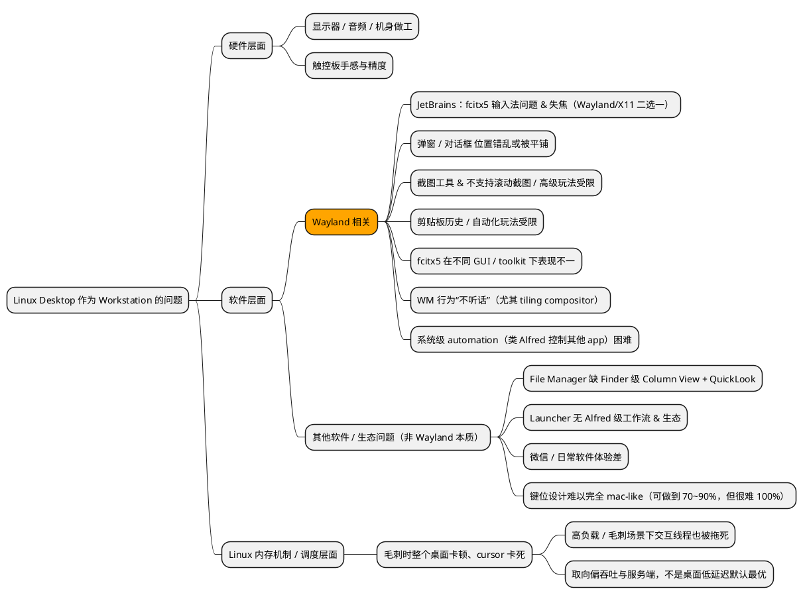

:::caution

注意本文仅适用于 **2025 年年底** 的当下（生态与版本变化很快，结论不保证长期成立）。

开篇明义：如果要给 **NixOS Desktop** 的体验打分，我会打 **60/100** —— **并非不能用，只是不好用**。

最终我会说两点：

1. **并非完全用不了**：我确实把它从“20 分”磨到了“60~70 分”，能工作、能开发、能日常，但需要你不断补洞。
2. **细节很重要**：真正折磨人的不是“大功能缺失”，而是那些“每天都要用到的细节”——输入法、截图、剪贴板、弹窗、快捷键一致性、毛刺时交互卡死……这些细节在 macOS 上是默认顺滑的，在 Linux Desktop 上往往变成“你来 glue 你来修”。

结论先丢在这里：

> **要说workstation体验，还得是macbook。目前还是只用Linux作为headless OS更靠谱**

:::

---

## 为什么会写这篇：从 MBP → NixOS Desktop → 又回到 MBP

先把前情提要写清楚，否则看起来像“我又在矫情地换系统”。

:::info

### 里程碑（milestones）

- **2025-07-11**：初试 nix（主要是 nix-darwin）
- **2025-09-20**：开始从 **MBP → NixOS Desktop**，把它当日常 workstation（持续三个月）
- **2025-12**：决定回到 **MBP 作为 workstation**；公司机器作为 **NixOS minimal** 的“重服务平台”

另外：我一开始没有用 KDE/GNOME 这种成熟 DE，而是走了更“nix 用户诱惑最大”的路线：不用 DE，从 0 到 1 自己 glue（niri + 通知/截图/剪贴板/launcher/热键/状态栏等）。

事实证明，这更是非常愚蠢的做法。

:::

---

## 当初为什么要从 MBP 迁移到 NixOS Desktop：恐惧与贪婪

我当时的动机可以概括为两点：**恐惧** 和 **贪婪**。

### 1）恐惧（厌烦）：macOS 的容器与 nix-darwin 的“不彻底”

- 我很厌烦 **macOS 不是原生 Linux**，Docker 需要靠 Linux VM / container 层模拟；这对“想把环境当成可复现系统”的人来说，总觉得别扭甚至愚蠢。
- 对 nix 用户来说，`nix-darwin` 和真正的 `NixOS` 终究是两码事。再叠加一次“cleanup 时我把 installer 相关的东西 gc 掉了”的事故（是的，很蠢），让我更坚定：**要玩 nix，就玩真的 NixOS**。

### 2）贪婪：想把日常 workstation 切到 Linux，从而逼自己更熟悉 Linux

- Darwin 终究是 BSD，命令、工具链、服务管理方式很多和 Linux 不一致（比如 systemd vs launchctl）。
- 我也确实在一定程度上达到了目的：systemd 相关命令、服务管理、排障方式，比之前熟悉太多了（大概达成 30%）。
- 当时我甚至写了句“久在樊笼里，复得返自然”，觉得 mac 是“小孩玩的”，NixOS 才是“返自然”。

现在回头看，这段心态很典型：**Nix 给了我一种“我能预配置一切”的幻觉**。而经历了 Desktop 以及我写的容器化方案那篇之后，我基本对 NixOS Desktop 祛魅了：

> **NixOS 对主流 CLI 工具的预配置能力非常强；但对 heavy 需求（复杂桌面、复杂服务、跨生态兼容）并没有那么“神”。**

---

## 核心问题到底是什么：不是“可不可以”，而是“ROI 值不值”

我现在更愿意用一句话来描述这三个月：

> **_问题永远解决不完。问题当然可以解决，但你会被“无穷无尽的小问题”磨到没有耐心。_**

所以“是否可以用 Linux Desktop 做 workstation”这个问题，核心并不是可否，而是：

- **你愿意付出多少时间，把它从 20 分磨到 60 分？**
- **你是否愿意长期承担“系统维护成本”，以及随时被生态坑一把的风险？**

当我把这当作“长期日常工具”去评估时，答案越来越清晰：**不值**。

---

## 一张总览图：Linux Desktop 作为 workstation 的问题分层

所有问题可以分成三类：**硬件层面 / 软件生态（尤其 Wayland）/ 调度与毛刺**。



下面按这三类展开。

---

## 1）硬件层面：你很难靠软件补回苹果那套体验

### 显示器 / 音频 / 机身做工

公司配的 Windows 本（普遍意义上）在屏幕观感、音质、做工一致性上很难跟 MBP 比。
这跟 OS 没关系：你把它刷成 NixOS 也不会突然变成 Mac 硬件。

### 触控板手感与精度

对我这种“触控板重度依赖用户”来说，触控板不是可选项，是生产力核心。

- 非 Apple 触控板在手势、加速度曲线、精度上就是差一截。
- 即使你用 Wayland + libinput 调到吐，也很难到 MBP 的 80/90 分体验。

硬件这一类的问题，决定了 Linux Desktop 做 workstation 的上限：你再怎么折腾，也只是“在差一点的硬件上把软件体验补齐”。

---

## 2）软件层面：Wayland + 桌面生态带来的“细节地狱”

我并不想写成“Wayland 批判文”，但这三个月的体验让我越来越确信：

- 一部分坑来自 **Wayland 还在快速演进**（协议/portal/toolkit/应用在同步追赶）
- 一部分坑来自 **生态不收敛**（GTK/Qt/Electron/Java/自绘 UI 各玩各的）
- 还有一部分坑来自 **安全模型刻意限制**（很多“X11 黑魔法”被砍掉或需要显式授权）

### 2.1 JetBrains / GoLand：输入法与焦点的两难（Wayland vs X11）

:::warning

这个问题在 已经解决了

:::

这是我最痛的一类问题：**IDE 是生产力核心，而输入法是日常必需品**。

现象大概是这样：

- 如果 GoLand / JetBrains IDE 走 **Wayland**：
  - 可能焦点切换更自然
  - 但 **fcitx5 输入法注入不稳定/不可用**（尤其中文输入）
- 如果强制走 **X11（XWayland）**：
  - 输入法通常更成熟
  - 但可能出现 **切换窗口后失焦，需要再点一下才能输入** 这类反直觉行为

我为了规避这一坨问题，最后做过“wrapper 一层强制 X11 启动”的 hack，并且依赖 `xwayland-satellite` 这种方式保证 XWayland daemon 正常运行，否则 IDE 甚至起不来。

这类问题的折磨点在于：
它不是“你少装了一个包”，而是 **协议/实现的边界问题** —— 你可以 workaround，但很难“一劳永逸”。

当时我记录过一些证据链（这里只放链接，不展开）：

- https://youtrack.jetbrains.com/projects/JBR/issues/JBR-5672/Wayland-support-input-methods
- https://forum.manjaro.org/t/some-applications-no-longer-work-with-fcitx5-in-wayland/181743/12

### 2.2 弹窗/对话框：在 tiling compositor 下更“违和”

我用 niri 这种 tiling compositor 的时间很长，越用越能体会到：

> **Linux Desktop（尤其 tiling WM）更像：OS → Window**
>
> **macOS 更像：OS → App → Window**

App 这层抽象带来的好处是：窗口行为与应用生命周期更解耦，很多“应该弹出来的东西”在 macOS 上很自然；而在 tiling WM 下，弹窗经常会被当成普通平铺窗口，位置、层级、交互预期更容易跑偏。

你当然可以写规则、写脚本、写窗口匹配，但你会发现：

- 规则复杂度会指数上涨（而且经常需要针对单个应用打补丁）
- 你调了一个弹窗规则，另一个 app 又炸

### 2.3 截图工具：flameshot 能用，但离 macOS 的“默认好用”差很远

我在 Linux 上用过 `flameshot`，能用，但体验大概只有 macOS 原生截图/第三方工具的 20%：

- 默认全屏截图直接保存本地：你怎么知道我不是想存到 clipboard 然后立刻发出去？
- 每次为了“全屏→剪贴板”，要绕好几个动作
- **滚动截图缺失**（对我这种写文档/做研究的人是刚需）

Wayland 的安全模型 + portal/pipewire 让截图/录屏链路更脆：能做，但“高级玩法”常常要自己拼。

### 2.4 剪贴板历史：能拼，但离“可视化与预览”差一口气

Linux 上最常见的拼法是 `cliphist + launcher`。
但我在 launcher 这块最终落在了 `fuzzel + raffi`，而 fuzzel **不支持 preview**，于是剪贴板历史只能看到前几个字，图片也无法预览。

再叠加 `cliphist` 本身对“搜索/取最近 N 项”的设计取向，你会发现它更像一个基础组件，而不是 Alfred 那种产品级体验。

- fuzzel 预览相关 PR / issue（证据链）：
  https://codeberg.org/dnkl/fuzzel/pulls/496
  https://codeberg.org/dnkl/fuzzel/pulls/593

### 2.5 系统级自动化（类 Alfred）：Wayland 时代更难“跨应用控制”

在 macOS 上，Alfred / Raycast 这类工具，本质是一个“统一自动化平台”。
Linux 上你可以实现很多 workflow，但更像“你自己搭建一套 pipeline”，而不是“系统给你统一接口”。

Wayland 的安全模型天然限制很多跨应用能力：读屏、模拟输入、全局 hook、窗口控制……不是不能做，而是要么走 compositor/portal 的“许可路径”，要么就别想像 X11 那样黑魔法随便玩。

---

## 3）Linux 调度/内存机制：毛刺时“鼠标都卡死”让我很难接受

:::warning

这点在切换到GNOME之后，已经基本上解决了，没有再遇到过鼠标卡死的问题

:::

这是非常主观但很真实的一点：

在一些高负载/毛刺场景下，我遇到过桌面整体卡顿、甚至 cursor 卡死，交互失去响应。

理论上你可以：

- 换低延迟内核 / PREEMPT
- 用 cgroup/cpuset 隔离交互线程
- 调 I/O 调度、swappiness、OOM 策略……

但问题在于：**这不是我想为 workstation 长期承担的成本**。

如果一个“日常开发桌面”需要你像调服务器一样长期调优才能稳定顺滑，那它对我来说就是“不适合作为默认选择”。

---

## WM / DE 的绕路：niri ↔ hyprland ↔（短暂 stacking）↔ 最后重新看 GNOME

我一开始很沉迷“自己 glue 一套桌面”，后来才意识到：

> **DE 之所以存在，就是为了把你从无穷无尽的 glue 里解放出来。**

### 4.1 niri：轻、稳，但窗口组织与弹窗生态成本很高

我 70% 的时间都在用 niri。它的优点很明确：

- 内存占用低且稳定（相对）
- Wayland 原生，很多行为干净利落

但我的核心痛点也很明确：

- tiling 不是不行，但 **窗口一多，定位成本极高**（尤其你在多 app、多 project、多个 IDE window 来回切）
- 弹窗/对话框在 tiling 语境下更容易“该弹的弹不出来 / 位置不如预期”
- 你会不断写规则、写脚本、写 glue，最后桌面本身变成一个长期维护项目

### 4.2 hyprland：更强的布局能力，但“好用”仍然不等于“省心”

我后来切到 hyprland 的一个主要原因是：它有更接近我直觉的窗口组织方式（例如 tabbed layout）。
但即使如此，它依然没有让整体体验达到“我不需要再思考桌面本身”的状态。

### 4.3 GNOME：它确实能解决一部分“桌面细节坑”（但也会堵死 wlroots 工具链）

到 2025-12 左右我重新试了 GNOME，发现一个现实：

- GNOME 这种成熟 DE，能在很多地方“兜底”
- 很多你在 tiling WM 下遇到的输入法、弹窗、窗口行为问题，GNOME 上会少很多（不是 0，但少很多）

所以如果按 5 分制：

- macOS：5 分
- GNOME：4 分
- 自己 glue 的 niri 桌面：2 分

但 GNOME 也带来一个关键冲突：**它会直接堵死一些你在 wlroots 系 compositor 下依赖的工具链**。

---

## 一个典型例子：fuzzel / raffi 在 GNOME Wayland 下无法使用

在 GNOME 下会看到类似报错：

```log
➜ fuzzel
err: wayland.c:2765: compositor is missing support for the Wayland layer surface protocol
err: fdm.c:133: no such FD: 6

➜ raffi-gh
err: wayland.c:2765: compositor is missing support for the Wayland layer surface protocol
err: fdm.c:133: no such FD: 7
```

根因很简单：

- `fuzzel`（以及一堆类似启动器）依赖 `wlr-layer-shell`（layer surface / layer-shell 协议）
- 这个协议常见于 **wlroots / KDE / COSMIC** 等 compositor
- **GNOME 的 Mutter 不实现 layer-shell**，所以纯 Wayland 的 fuzzel 在 GNOME 上原生 Wayland 会话里直接报错

这也解释了一个经常让人困惑的点：

> GNOME 当然是 Wayland，但 Wayland 不是“一个统一完整的东西”，而是一族协议与扩展；**最终实现哪些扩展，是 compositor 决定的**。

因此在 GNOME 下想实现“像 fuzzel 那样的 launcher”，路会被堵在：

1. **协议不支持（layer-shell）**
2. **架构不匹配（GNOME launcher 是 Shell 内建，不欢迎外部替换）**
3. **Wayland 安全模型限制（全局控制更集中）**

:::tip

唯一解决方案：

- 想要“像 fuzzel 一样随叫随到的独立浮层 launcher”：基本不成立（协议/架构都不配合）
- 想要可用：要么 **XWayland 跑 rofi**，要么 **拥抱 GNOME Overview**，要么 **写 GNOME Shell 扩展**（做菜单/脚本入口）

:::

---

## Launcher 的长故事：从 Alfred 到 Linux 的“替代方案”，以及为什么我不满意

Alfred 是我在 macOS 上的“第二大脑”。因此迁移到 Linux 时，我最关注的之一就是 launcher。

我的目标其实很明确：轻量、Wayland 兼容、可脚本化、能承载 workflow，并尽量覆盖 Alfred 的核心功能（snippets、web search、workflow、clipboard history、universal actions）。

现实是：Linux 上你能拼出 70% 的体验，但那剩下 10%~30% 的细节非常要命。

### 我最终为什么又回到 fuzzel + raffi（尽管不满意）

我试了一圈（rofi 系、walker、ulauncher、vicinae 等等），最后还是回到 `fuzzel + raffi`，原因很现实：

- 轻量（至少相比一堆 GTK4/大 daemon 的方案）
- workflow 更容易用 shell / nushell / go 写（我更喜欢“bin + wrapper”的思路，而不是被迫迁移到 TS 插件生态）
- 能做到“够用”，并且我可以靠自己补很多 workflow（bookmark、pwgen、snippets、clipboard text-action、github search、nosleep 等）

但它依然有一堆“致命的 10%”：

- **fuzzel 不支持 fcitx5**（这点非常要命）
- 不支持 preview
- 不支持一些细节操作（例如翻页/输入交互逻辑等）
- workflow 生态与 UI/交互打磨，与 Alfred 差了一个“产品级”的距离

这些问题最折磨人的点是：它们都很小，但每天都会碰到，所以不断摩擦你的注意力。

---

## 键位设计：mac-like keymap 能做到 70~90%，但很难 100%

我曾经强烈想把 Linux 的键位做成“mac-like”：让 Mod（Win 键）扮演 Cmd，让 Ctrl 回归“终端/控制键”的语义。

这件事最终的结论是：

- 工具很多（keyd / xremap / kinto 类方案），也确实能做到 **70~90%**
- 但最后那 **10%** 很难做：因为 shortcut 的解释权在不同应用、不同 toolkit、不同输入法层上，行为很难一致
- 再叠加 Wayland 对“全局捕获/注入”的限制，你会不断遇到“这个 app 就不听话”

所以我后来反而释然了：**与其追求 100% 的“像 mac”，不如接受 Linux 的世界观，减少折腾面**。

---

## 最终方案：Mac 做交互，Linux 做重服务（把桌面从“项目”变回“工具”）

回到一开始的问题：

> 我是否可以使用 MBP 作为 workstation？

答案是可以，而且对我来说这是最划算的结构：

- **公司机器**：刷成 **NixOS minimal**，跑所有重服务（容器、后台任务、长编译、需要稳定网络/电源的东西）
- **我的 MBP**：只做交互与轻量本地（IDE、浏览器、沟通、写作、查资料）

换句话说：

> 我把 Linux 从“桌面”降级成“远程开发/服务平台”，把“交互体验”交回 macOS。

这套结构的本质是 **解耦**：

- Linux 擅长：可复现环境、稳定服务、systemd 管理、资源可控
- macOS 擅长：交互细节、桌面一致性、应用生态与产品级体验

---

## 风险清单：别把“爽”建立在合规与单点故障上

这套方案不是没有代价，至少要提前把下面几项想清楚。

### 1）公司安全合规：代码/数据是否允许出现在个人设备？

这是第一优先级的问题：
你必须确认公司政策允许你在个人 MBP 上做多少事——代码、数据、密钥、客户信息、内网资源……边界要非常清楚。

### 2）网络可达性：公司机器如何稳定远程访问？

如果公司机器承担“开发机/服务机”的角色，你要保证：

- 它默认可达（内网/VPN/跳板机/固定入口）
- 你在家/公司/外出时都能稳定连接
- 断网、切网时的 fallback 方案是什么

### 3）单点故障：MBP 或公司机器挂了怎么办？

- 公司机器挂了：服务全挂、开发环境全挂？
- MBP 挂了：你是否还有备用交互设备？
- 数据与配置如何备份恢复？恢复时间能否接受？

### 4）secrets 管理：别把未来的 rotate key 变成噩梦

这是最容易被忽略但最容易“未来爆炸”的点：
如果 secrets 管理没有体系化，换机器/离职/权限变动/rotate key 时会非常痛苦。

---

## 如果重来一次：我会怎么做（复盘）

最后写一点“复盘意义”，给未来的自己（以及可能读到这里的人）：

1. **如果目标是生产力**：别从 0 glue 桌面。直接选 GNOME/KDE 这种成熟 DE。
   “自己 glue”很酷，但它是一个长期维护项目，不是工具。
2. **如果目标是学习 Linux**：可以玩，但要明确边界。
   学 systemd、学网络、学容器、学内核调优，都可以；但别把“桌面体验”当成学习指标，否则很容易掉进细节黑洞。
3. **如果必须 Linux desktop**：优先把“输入法/截图/剪贴板/launcher”这四件事先搞到你能忍的程度，再谈别的。
   因为这些是你每天都会碰到的摩擦源。
4. **别迷信 Nix 的“预配置幻觉”**：
   Nix 很强，但它不等于“你不用再处理现实世界的兼容性与生态分裂”。

---

## 最终结论

如果 macOS 的体验是 5 分：

- GNOME 我可以给 4 分（成熟 DE 帮你兜底很多细节）
- 自己 glue 的 niri 桌面 大概只有 2 分（不是不能用，而是维护成本太高、细节摩擦太多）

所以我最终选择：

> MBP 做 workstation，Linux 做 minimal / remote dev / service platform。

## 附录

下面这些是“证据链/材料库”，需要时再下钻。

<details>
<summary>Wayland / JetBrains / 输入法（证据链）</summary>

- https://youtrack.jetbrains.com/projects/JBR/issues/JBR-5672/Wayland-support-input-methods
- https://forum.manjaro.org/t/some-applications-no-longer-work-with-fcitx5-in-wayland/181743/12

</details>

<details>
<summary>截图 / 剪贴板 / 预览（证据链）</summary>

- flameshot：https://github.com/flameshot-org/flameshot
- fuzzel 预览相关：
  - https://codeberg.org/dnkl/fuzzel/pulls/496
  - https://codeberg.org/dnkl/fuzzel/pulls/593

</details>

<details>
<summary>GNOME 下 fuzzel 报错（layer-shell 缺失）</summary>

```log
err: compositor is missing support for the Wayland layer surface protocol
```

含义：GNOME Mutter 不实现 fuzzel 依赖的 layer-shell 扩展，因此在 GNOME Wayland 会话下原生不可用。

</details>
